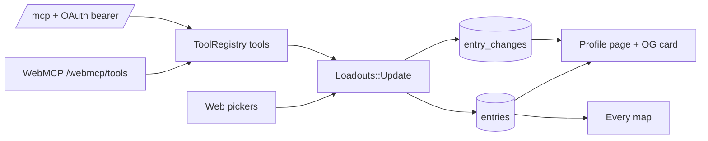

# Loadout - Plan

## Goal Capsule

- **Objective:** Ship v1 of Loadout (`loadout.every.to`): people sign in with Every, claim a link like `loadout.every.to/kieran`, and keep a good-looking profile of which AI tools and models they use per category. They report on the web or let their agent report through OAuth-connected MCP. Signed-in Every members get an Every-wide "AI map" for discovery.
- **Product authority:** Kieran Klaassen. This plan owns the v1 core (profiles, reporting, the Every map). Release markers, the timeline view, the public trend map and external data are later areas and not active scope.
- **Stop conditions:** Stop and report if Every OAuth cannot serve non-staff accounts, or if MCP clients reject the OAuth flow.
- **Execution profile:** Foundation units U1–U2 run serially. U3–U8 can run in parallel worktrees. U9 closes. One PR carries v1.
- **Open blockers:** None for planning. Deploy needs a DNS record and an Every OAuth client from Kieran (see Dependencies).

## Product Contract

### Summary

Loadout is a self-report profile app for AI tools and models. v1 covers four things:
- A fast onboarding that claims a handle and picks tools per category in about a minute.
- Shareable public profiles with rich OG images.
- An MCP server (OAuth 2.1) plus WebMCP, so an agent can fill in a profile for you.
- An Every map showing the most-used tools and models per category and who uses what.

Every change is stored with a date, so a timeline can come later without migrating data.

### Problem Frame

At Every, people discover AI tools by accident, in a Slack aside or a demo. Nobody can see what the company actually runs on, who has tried video models, or who is still on last quarter's model. Existing surfaces don't answer this:
- `/uses` pages and new "AI stack" sites (AFIT, Stackness, aistack.to) are individual and public-first.
- Measured sources (OpenRouter, Ramp, the Anthropic Economic Index) are vendor-level.
- Enterprise admin APIs cover only coding tools, and only on Enterprise plans.

None of them shows per-person, per-task-category tools and models with a company view. Self-reported trackers usually go stale. Loadout keeps staleness down with frictionless reporting instead of reminders: the web picker is quick, and agents can report through MCP. Weekly check-ins happen outside the app, for example a person's own agent routine calling the MCP server.

### Name

**Loadout.** Your loadout is the kit you carry into the work. The word reads naturally in a URL (`loadout.every.to/kieran`), on a profile ("Kieran's loadout"), and in a share card. The company page is "the Every map".

### Key Decisions

- **Self-report only; no Slack, nudges or measured imports in v1.** The app hosts profiles and accepts reports. Check-in cadence lives in people's own agents. Governs R10, R14. (session-settled: user-directed — chosen over release-triggered Slack nudges, periodic check-ins and admin-API imports: keep v1 focused on great profiles and easy reporting.)
- **MCP uses OAuth, not pasted API tokens.** Follow the MCP authorization spec (OAuth 2.1, PKCE, dynamic client registration) so Claude, Cursor and similar clients connect through a sign-in flow. Governs R14–R17. (session-settled: user-directed — chosen over happyhappy-style per-agent bearer tokens: clients should connect with a sign-in flow.)
- **Web sign-in is Every OAuth, open to anyone with an Every account.** Every staff are identified by a verified `@every.to` email. Governs R1, R3. (session-settled: user-directed — chosen over an internal-only allowlist: anyone can create an account and claim a link.)
- **Private by default, with a public toggle.** Governs R5, R6. (session-settled: user-directed — chosen over public-by-default profiles.)
- **Keep a dated change history from day one.** Governs R11. (session-settled: user-directed — chosen over overwrite-only profiles: a later timeline needs history.)
- **Build on `kieranklaassen/compound-stack-rails` 0.8.0** (WebMCP module, Flipper), reusing happyhappy's Every SSO pattern. Governs R18. (session-settled: user-directed — chosen over a fresh stack.)
- **Design quality is the top priority.** Views should be beautiful, shareable, and in Every's visual style. Governs R20–R22. (session-settled: user-directed.)
- **Private entries still count, anonymously, in Every map totals; only public profiles are named.** Discovery works on day one without exposing private profiles. Onboarding says this plainly. Governs R24, R25.

### Actors

- A1. **Member:** anyone signed in with Every. Owns one profile.
- A2. **Every member:** a member with a verified `@every.to` email. Sees the Every map, and their entries feed it.
- A3. **Agent:** an MCP client (Claude, Cursor, Codex, Claude Code) authorized by a member through OAuth, or a WebMCP-capable browser agent acting inside the member's session.
- A4. **Visitor:** anyone, signed in or not, opening a public profile or its share card.
- A5. **Admin:** Kieran or a named admin who curates the catalog.

### Requirements

**Accounts and handles**
- R1. Members sign in with Every OAuth. No password sign-up exists in production.
- R2. On first sign-in, a member claims a unique handle that becomes their profile URL (`/<handle>`). Handles are lowercase, and reserved words (routes, `every`, `admin`, `map` and similar) can't be claimed.
- R3. A member whose verified Every email is on `every.to` is marked an Every member automatically.
- R4. A member can change their handle and delete their account, which removes their profile and entries.

**Profiles and visibility**
- R5. New profiles are private: only the owner can see them.
- R6. The owner can switch the profile between private and public at any time. A public profile is readable by anyone at `/<handle>` without signing in. A private profile answers "not found" to everyone except its owner.
- R7. A profile shows the member's name, avatar, optional one-line bio, and their loadout grouped by category, with the primary tool and model per category emphasized.

**Catalog and entries**
- R8. Loadout ships with a seeded catalog of categories, tools and models:
  - Categories: coding, knowledge work, writing, research, classification, image, video, animation, text to speech, speech to text, music, and other.
  - Each tool and model has a name, a maker, and a mark or logo treatment.
- R9. A member can add a missing tool or model by name while picking. It is usable immediately and flagged for admin review. Admins can edit, merge or hide catalog items.
- R10. An entry records a category, a tool, an optional model, and an optional short note ("why"). A member can have several entries per category and mark one as primary.
- R11. Every add, change or removal of an entry is recorded as a dated change event with its source (web, MCP with the client's name, or WebMCP). The current loadout is derivable from these events.
- R12. A profile shows a short "recent changes" list derived from R11 (for example "Switched coding model to Claude Opus 5.5, Sep 2026").

**Onboarding**
- R13. A new member can go from "Sign in with Every" to a finished profile in about a minute: claim a handle, tap tools and models per category from visual pickers (categories can be skipped), choose visibility, and see their profile with share actions.
- R14. Onboarding and settings offer "Connect your agent" as an equal alternative to the picker. It gives the MCP server URL with copy-ready setup for Claude (connector), Claude Code, Cursor and Codex, plus a suggested prompt ("Fill in my Loadout from what you know about how I work").

**Agent reporting (MCP and WebMCP)**
- R15. Loadout exposes an MCP server. It lets an agent read the catalog, read the member's current loadout, add, change or remove entries, and read recent changes. Changing visibility and deleting the account are web-only.
- R16. MCP clients authorize through the MCP authorization spec: protected-resource and authorization-server metadata, dynamic client registration, authorization code with PKCE, a consent screen after Every sign-in, and refresh tokens. No pasted tokens are needed.
- R17. A member sees their connected agents (client name, last used) and can revoke any of them. Revocation takes effect on the agent's next call.
- R18. The same tools are available through WebMCP while the member is signed in, using the stack's WebMCP module.
- R19. Agent writes follow the same validation as web writes. Unknown tools or models become flagged catalog additions per R9.

**Design and sharing**
- R20. Public pages and the Every map follow Every's visual language: editorial typography, generous whitespace, a restrained palette, and strong tool marks. Layouts are responsive, and the phone view is designed rather than squeezed.
- R21. Each public profile has a generated OG image (1200×630) showing the member's name, avatar and top picks per category. It unfurls well in Slack, X, iMessage and LinkedIn. The image refreshes after changes.
- R22. Public profiles have a "Share" action (copy link, share on X) and a small "Make your own Loadout" call to action for visitors.

**Every map**
- R23. Signed-in Every members see `/map`: for each category, the most-used tools and the most-used models, ranked by number of people, with share bars.
- R24. Counts include all Every members' current entries, private ones included, without names. Selecting a tool or model lists the public profiles that use it and adds "and N others".
- R25. The map highlights discovery for the viewer: categories where they have no entries, with what colleagues use there, and models they use that colleagues have moved past.
- R26. Non-Every members who open `/map` see an explanation, not data. A public map is a later phase behind a Flipper flag.

### Key Flows

- F1. **First-run onboarding** (Covers R1–R3, R5, R13):
  1. **Trigger:** A visitor clicks "Sign in with Every".
  2. After OAuth, the member is asked to claim a handle, prefilled from their name.
  3. They pick tools and models in each category, or skip.
  4. They choose private or public.
  5. They land on their profile with share actions and a "Connect your agent" card.
- F2. **Agent fills a profile** (Covers R14–R17, R19):
  1. The member adds the MCP URL to Claude Code, Cursor or Claude.
  2. The client registers itself and opens the browser.
  3. The member signs in with Every and approves.
  4. The agent reads the catalog, writes entries, and reports back.
  5. The profile shows the entries with the source "Claude Code".
- F3. **Discovery on the map** (Covers R23–R25):
  1. An Every member opens `/map` and sees that nobody on their profile does video.
  2. They open "video", see that three colleagues use Runway with a named model, and open a public profile.
  3. They add Runway to their own loadout in one click.

### Acceptance Examples

- AE1. **Covers R5, R6.** A newly onboarded member leaves visibility at the default. A signed-out visitor opening `/<handle>` gets a 404. After the member toggles public, the same URL renders the profile and its OG image.
- AE2. **Covers R11, R12.** A member switches their primary coding model from Opus 5 to Opus 5.5 through MCP. Two events are stored with dates and the source "Claude Code". The profile shows "Switched coding model to Claude Opus 5.5".
- AE3. **Covers R16, R17.** A member revokes the Cursor agent in settings. Cursor's next tool call is rejected as unauthorized, and Cursor can reconnect only by going through sign-in and consent again.
- AE4. **Covers R24.** Five Every members use Cursor for coding, and two of them are public. The map shows Cursor with 5 people, names the two public members, and shows "and 3 others".
- AE5. **Covers R19, R9.** An agent reports the tool "Hedra". It isn't in the catalog, so it is created, flagged for review, and shown on the member's profile immediately.

### Success Criteria

- A new member finishes onboarding in about 60 seconds on desktop and on a phone.
- Claude Code and Cursor connect to the MCP server through the OAuth flow with no manual token handling, and fill a profile from one prompt.
- Public profile links unfurl with the custom OG image in Slack and X.
- Kieran would share his own profile publicly without design caveats.
- CI is green, with system tests for onboarding, visibility, MCP OAuth and the map.

<!-- ce-section: work-relationships -->
### How This Work Fits Together

This plan owns the v1 core: profiles, web and agent reporting, and the Every map. The breakdown below is current understanding, not a committed roadmap.
- **Release markers:** new models from models.dev appear as dated markers. Depends on this plan's catalog. Can proceed independently of the timeline view.
  - **Timeline view:** switches over time against release markers. Depends on R11 history and on release markers.
- **Public AI map:** the aggregate map opened to the public (Flipper-gated per R26). Depends on the Every map. Still to decide: anonymity thresholds.
  - **External contributors and trend data:** non-Every members feeding a public "AI map" for Every content. Depends on the public AI map.
- **Token usage:** optional measured or self-reported usage volume. Still to decide whether it stays internal-only.

### Scope Boundaries

**Deferred for later:** models.dev release markers, timeline view, public aggregate map, external trend reporting, token usage, Slack entry or digests, nudges and check-ins, an "Every-only" visibility level, follows and feeds.

**Outside this product's identity:** measured telemetry or admin-API imports, model quality rankings or reviews (LMArena's job), spend and ROI dashboards (Jellyfish's job), prompt or config sharing.

### Dependencies / Assumptions

- The Every OAuth provider (as used by happyhappy) issues accounts to people outside Every staff and returns a verified email. If it only serves staff, "anyone can create an account" narrows to Every accounts. That still works for v1.
- Deploy is Kamal on Hetzner, like happyhappy. Kieran provides:
  - an A record for `loadout.every.to` pointing at the server;
  - an Every OAuth client with callback `https://loadout.every.to/auth/every/callback`.
- MCP clients (Claude, Cursor, Claude Code, Codex) support the OAuth flow of the 2025-06-18 or later MCP authorization spec.

### Sources / Research

- Prior art: OpenRouter rankings, `/uses` pages, StackShare, the ThoughtWorks Tech Radar, State of AI surveys, AFIT, Stackness, and models.dev (release dates for the later release-marker phase).
- Every SSO and MCP patterns: `kieranklaassen/happyhappy` (`lib/omniauth/strategies/every.rb`, `/mcp` Streamable HTTP).
- Stack: `kieranklaassen/compound-stack-rails` 0.8.0 (`docs/modules/webmcp.md`, `docs/modules/feature_flags.md`, `docs/modules/deploy.md`).
- MCP authorization spec: https://modelcontextprotocol.io/specification/2025-06-18/basic/authorization

## Planning Contract

### Key Technical Decisions

- KTD1. **Port happyhappy's "Sign in with Every" as-is, but admit every Every account.** Copy `lib/omniauth/strategies/every.rb`, `Sessions::EveryController` and `User::EveryIdentity` from `kieranklaassen/happyhappy`. Drop the staff-only refusal. `every_member` becomes a derived flag (`User.every_email?`). Password sign-in stays only as a development and test login. Covers R1, R3. (session-settled: user-directed — chosen over an internal-only allowlist: anyone can create an account and claim a link.)
- KTD2. **Build a small OAuth 2.1 authorization server in-app, with no Doorkeeper.** It covers:
  - RFC 9728 protected-resource metadata and RFC 8414 authorization-server metadata;
  - RFC 7591 dynamic client registration for public clients;
  - authorization code with S256 PKCE only;
  - RFC 8707 `resource` binding to `<PUBLIC_BASE_URL>/mcp`;
  - rotating refresh tokens and RFC 7009 revocation.

  Tokens are random secrets stored only as SHA-256 digests. Doorkeeper has no dynamic registration and no resource indicators, and it adds a large configuration surface for four endpoints. Covers R16, R17. (session-settled: user-directed — chosen over happyhappy-style pasted bearer tokens: clients connect through a sign-in flow.)
- KTD3. **`/mcp` is stateless Streamable HTTP served by `ToolRegistry.mcp_server(user:)`.** It mirrors happyhappy's `McpController`. A missing or invalid token answers 401 with `WWW-Authenticate: Bearer resource_metadata="<base>/.well-known/oauth-protected-resource"`. `server_context` carries `user`, `source: "mcp"` and the OAuth client, so change events record the client name. Covers R15, R18.
- KTD4. **Change events are the history; entries are the current state.** `Loadouts::Update` is the one write path for web, MCP and WebMCP. It changes `entries` and appends `entry_changes` rows (`added`, `removed`, `updated`, `made_primary`) in one transaction. The current loadout is read from `entries` for speed. The events are complete enough to rebuild it. Covers R10, R11, R19.
- KTD5. **The catalog is seeded from `config/catalog.yml` by an idempotent `Catalog::Sync`.** It runs from `db:seed` and on deploy. Items are keyed by slug. Member-added items get `status: pending` and `created_by`. Admins approve, rename, merge (repoint entries and changes) or hide them. Covers R8, R9.
- KTD6. **Typographic tool marks, with no third-party logos.** Each tool and model has a brand hue and a one- or two-letter monogram, rendered as a rounded tile. This avoids logo licensing and keeps OG images and pages consistent. Covers R8, R20.
- KTD7. **Render OG images with libvips from an SVG template.** A `ProfileCard` builds an SVG (name, avatar, top picks) and renders it to PNG with `Vips::Image.svgload_buffer`. The PNG is cached under a key that includes the profile's `loadout_updated_at`, served at `/<handle>/og.png`, and returns 404 for private profiles. The Docker image adds the fonts. Covers R21.
- KTD8. **Match Every's editorial look with open fonts.** Use a serif display face (Newsreader) with a clean sans (Inter), self-hosted through `@fontsource`. The palette is off-white paper, near-black ink, one accent, thin rules, and large type. Tailwind 4 tokens live in `app/frontend/entrypoints/application.css`. Covers R20.
- KTD9. **Handles live on the root path.** `get ":handle"` is the last route, with a `[a-z0-9-]{2,30}` constraint and a reserved-word list. Covers R2.
- KTD10. **Adopt Flipper per `docs/modules/feature_flags.md` with one flag, `public_map`.** When it is enabled for a visitor, `/map` renders for non-Every members. Covers R26.
- KTD11. **Map aggregates are computed live with grouped SQL.** Every-member counts per category and tool or model come from `entries` joined to users. At Every's size this needs no cache table. Covers R23–R25.

### High-Level Technical Design

The OAuth handshake for an MCP client:
1. The client calls `/mcp` and gets a 401 with `resource_metadata`.
2. It fetches `/.well-known/oauth-protected-resource` and `/.well-known/oauth-authorization-server`.
3. It POSTs `/oauth/register`.
4. It opens `/oauth/authorize?...code_challenge...&resource=...`. The member signs in with Every if needed and sees the consent screen.
5. The browser redirects back with a code, and the client exchanges it at `/oauth/token` for an access token (1 hour) and a refresh token (30 days, rotating).

### Assumptions

- The Every OAuth `basic_profile` UserInfo returns `user_id`, `email`, `name` and `avatar_url` for any every.to account, as happyhappy relies on.
- Current Claude, Claude Code, Cursor and Codex MCP clients implement dynamic registration and PKCE per the 2025-06-18 authorization spec.
- SQLite is enough. Expected load is hundreds to low thousands of members.

### Sequencing

U1 is the foundation. U2 needs U1. U3, U4, U5, U6 and U7 all need U2, and they touch mostly separate files, so they can proceed in parallel once U2 lands. U8 needs U2. U9 comes last.

## Implementation Units

| U-ID | Title | Key files | Depends on |
|---|---|---|---|
| U1 | App identity, Every SSO, design system shell | `lib/omniauth/strategies/every.rb`, `app/controllers/sessions/`, `app/models/user*`, `app/frontend/entrypoints/application.css`, `app/frontend/components/` | none |
| U2 | Catalog, entries, change history, write service | `app/models/{category,tool,ai_model,entry,entry_change}.rb`, `app/services/loadouts/update.rb`, `config/catalog.yml` | U1 |
| U3 | Onboarding and loadout editor | `app/controllers/onboarding_controller.rb`, `app/controllers/loadouts_controller.rb`, `app/frontend/pages/onboarding/`, `app/frontend/pages/loadout/` | U2 |
| U4 | Profile pages, visibility, sharing, OG image | `app/controllers/profiles_controller.rb`, `app/models/profile_card.rb`, `app/frontend/pages/profiles/` | U2 |
| U5 | Every map and discovery | `app/controllers/maps_controller.rb`, `app/queries/map_stats.rb`, `app/frontend/pages/map/` | U2 |
| U6 | Agent tools (MCP + WebMCP) | `app/tools/*_tool.rb`, `app/tools/tool_registry.rb` | U2 |
| U7 | OAuth 2.1 server, `/mcp`, connected agents | `app/controllers/oauth/`, `app/controllers/well_known_controller.rb`, `app/controllers/mcp_controller.rb`, `app/models/oauth_*.rb`, `app/frontend/pages/agents/` | U6 |
| U8 | Admin catalog review and Flipper | `app/controllers/admin/`, `config/initializers/flipper.rb` | U2 |
| U9 | Landing page, deploy config, docs | `app/frontend/pages/home/`, `config/deploy.yml`, `Dockerfile`, `README.md`, `DEPLOYING.md` | U3–U8 |

### U1. App identity, Every SSO, design system shell

- **Goal:** The app is Loadout. Members sign in with Every. Pages share one editorial shell.
- **Requirements:** R1, R3, R20. KTD1, KTD8.
- **Files:** `config/application.rb` (module `Loadout`), `lib/omniauth/strategies/every.rb`, `config/initializers/omniauth.rb`, `app/controllers/sessions/every_controller.rb`, `app/controllers/sessions_controller.rb` (dev and test password login only), `app/models/user.rb`, `app/models/user/every_identity.rb`, a migration adding `every_user_id`, `name`, `avatar_url`, `handle`, `bio`, `public`, `admin` and `loadout_updated_at` to users and making `password_digest` nullable, `app/frontend/entrypoints/application.css`, `app/frontend/components/{layout,tool_mark,button}.tsx`, `app/frontend/pages/auth/sign_in.tsx`.
- **Approach:** Port the happyhappy files and remove `refuse`. Add `omniauth-oauth2` and `omniauth-rails_csrf_protection` if happyhappy uses them. Build the shell: a top bar with the wordmark "Loadout", "Map" (Every members), "Your loadout" and an avatar menu. Delete `WhoamiTool` once U6 lands.
- **Test scenarios:** the Every callback creates a user and a session; a second sign-in updates the name and avatar; `every_member?` is true only for exact `every.to` emails; an unconfigured client redirects with a message; the sign-in page renders "Sign in with Every".
- **Verification:** `bin/rails test test/controllers/sessions`, `npm run check`.

### U2. Catalog, entries, change history, write service

- **Goal:** One domain model and one write path for loadouts.
- **Requirements:** R8–R11, R19. KTD4, KTD5, KTD6.
- **Files:**
  - Models: `app/models/category.rb`, `tool.rb`, `ai_model.rb`, `entry.rb`, `entry_change.rb`.
  - Services: `app/services/catalog/sync.rb`, `app/services/loadouts/update.rb`.
  - Data: `config/catalog.yml`, `db/seeds.rb`, migrations.
  - Tests: under `test/models` and `test/services`.
- **Approach:**
  - Category: `slug`, `name`, `blurb`, `position`.
  - Tool and AiModel: `slug`, `name`, `maker`, `hue`, `monogram`, `status` (approved, pending, hidden), `created_by_id`, and `category_slugs` as suggestion hints. AiModel also has `family` and `released_on`.
  - Entry: `user`, `category`, `tool`, `ai_model` (optional), `note`, `primary`. Unique on `[user, category, tool, ai_model]`.
  - EntryChange: `user`, `category`, `tool`, `ai_model`, `action`, `source`, `client_name`, `details` (json), `created_at`.
  - `Loadouts::Update` accepts operations `add`, `remove`, `set_primary` and `update_note`, plus `replace_category` (sets the full list for a category and emits a diff of changes). It resolves tools and models by slug, or by name with case-insensitive lookup, and creates pending items for unknown names. It enforces at most one primary per category and bumps `users.loadout_updated_at`.
  - Seed at least 12 categories and a broad catalog: coding tools (Cursor, Claude Code, Codex, Copilot, Windsurf, Zed, Amp, Devin), assistants (Claude, ChatGPT, Gemini, Perplexity, NotebookLM), media tools (Midjourney, Runway, Sora, Veo, Kling, Pika, ElevenLabs, Whisper, Suno, Hedra, Figma Weave), classification (TypeSafe Jev, the OpenAI API), and current models (Claude Opus 5.5, Opus 5, Sonnet 5, Fable 5, GPT-6 Astra, GPT-5.6, Gemini 3.8, Grok 4.7 and others).
- **Test scenarios:** adding records an `added` change with its source; replacing a category emits `added` and `removed` for the diff only; `set_primary` clears the previous primary and records `made_primary`; an unknown tool name creates a pending tool; a duplicate add is a no-op with no change row; `Catalog::Sync` is idempotent and does not un-hide admin-hidden items.
- **Verification:** `bin/rails test test/models test/services`.

### U3. Onboarding and loadout editor

- **Goal:** From sign-in to a finished profile in about a minute. Editing is always one click away.
- **Requirements:** R2, R4, R5, R13, R14. F1.
- **Files:** `app/controllers/onboarding_controller.rb`, `app/controllers/loadouts_controller.rb`, `app/controllers/settings_controller.rb`, `app/frontend/pages/onboarding/{handle,picks,done}.tsx`, `app/frontend/pages/loadout/edit.tsx`, `app/frontend/pages/settings/index.tsx`, `app/frontend/components/{tool_picker,category_card}.tsx`, `app/models/handle.rb` (validation and reserved list).
- **Approach:**
  - A signed-in member without a handle is redirected to `/welcome`. Step one claims the handle, prefilled from the name, with live availability through an Inertia partial reload. Step two is a category-by-category picker grid: tap a tool, optionally pick a model chip, and move on. Step three chooses visibility and shows share and "Connect your agent" cards.
  - All saves go through `Loadouts::Update` with `source: web`.
  - Settings covers handle change, bio, visibility toggle, and account deletion with confirmation.
- **Test scenarios:** the first sign-in redirects to `/welcome`; a reserved or taken handle is rejected with a message; the picker save creates entries and changes; skipping all categories still completes; deleting the account removes the user, entries and changes and signs out; the handle change takes effect and the old handle 404s.
- **Verification:** controller tests plus Vitest for the picker component.

### U4. Profile pages, visibility, sharing, OG image

- **Goal:** Beautiful public profiles that unfurl well.
- **Requirements:** R5–R7, R12, R21, R22. KTD7, KTD9. AE1, AE2.
- **Files:** `app/controllers/profiles_controller.rb`, `app/controllers/profile_cards_controller.rb`, `app/models/profile_card.rb`, `app/frontend/pages/profiles/show.tsx`, `app/views/layouts/application.html.erb` (OG and Twitter meta from props or `content_for`), `vendor/fonts/` or Docker font packages.
- **Approach:**
  - `/:handle` renders for the owner always and for everyone else only when public. Otherwise it answers 404.
  - The page shows a hero (avatar, name, bio, "Every" badge for members) and category sections with tool marks. Primary picks are large and the rest small. Notes appear as pull quotes. A "Recent changes" timeline shows the last 10 changes in human sentences. A share bar offers copy link and X. Visitors see a "Make your own Loadout" call to action.
  - Meta tags carry `og:image` pointing at `/:handle/og.png?v=<loadout_updated_at.to_i>`.
- **Test scenarios:** a private profile answers 404 to a visitor and 200 to its owner; a public profile answers 200 signed out; `og.png` returns an `image/png` of 1200×630 for public profiles and 404 for private ones; the change sentences render ("Switched primary coding model to Claude Opus 5.5"); meta tags are present in the HTML.
- **Verification:** controller tests, plus a PNG dimension check with `Vips::Image.new_from_buffer`.

### U5. Every map and discovery

- **Goal:** An Every-wide view of what people use, built for discovery.
- **Requirements:** R23–R26. KTD10, KTD11. F3, AE4.
- **Files:** `app/controllers/maps_controller.rb`, `app/queries/map_stats.rb`, `app/frontend/pages/map/{index,category}.tsx`.
- **Approach:**
  - `MapStats` returns, per category, the top tools and top models with people counts and share of category users. Counts cover all Every members' entries; only public profiles are named, and the rest appear as "and N others".
  - The discovery panel shows categories where the viewer has no entries, and models the viewer uses where most colleagues in that category use a newer model of the same family (by `released_on`).
  - `/map/:category` shows the full ranking and a people list.
  - Non-Every viewers get an explainer unless `public_map` is enabled for them.
- **Test scenarios:** AE4 counts and naming; private users are not named; a non-Every member sees the explainer; discovery lists empty categories; the "newer model" hint appears when colleagues are on a newer model of the same family.
- **Verification:** query and controller tests.

### U6. Agent tools (MCP + WebMCP)

- **Goal:** Agents can read and update a loadout through one tool registry.
- **Requirements:** R15, R18, R19. KTD3, KTD4. AE5.
- **Files:** `app/tools/{list_categories,search_catalog,get_my_loadout,update_loadout,get_recent_changes}_tool.rb`, `app/tools/tool_registry.rb`, `app/tools/application_tool.rb` (pass `source` and `client_name` from `server_context`), `app/controllers/webmcp_tools_controller.rb` (`source: webmcp`).
- **Approach:**
  - `update_loadout` takes a list of operations (per U2) with categories, tools and models by slug or name, and returns the new loadout plus the changes it made.
  - Tool descriptions teach agents the categories and the "ask the member before guessing" etiquette.
  - Remove `WhoamiTool`.
- **Test scenarios:** each tool through `ToolRegistry.call`; `update_loadout` with an unknown tool creates a pending item; the WebMCP call records `source: webmcp`; the read-only hints are correct.
- **Verification:** `bin/rails test test/tools test/integration`.

### U7. OAuth 2.1 server, `/mcp`, connected agents

- **Goal:** MCP clients connect through a sign-in flow, and members can revoke them.
- **Requirements:** R14, R16, R17. KTD2, KTD3. F2, AE3.
- **Files:** `app/controllers/well_known_controller.rb`, `app/controllers/oauth/{registrations,authorizations,tokens,revocations}_controller.rb`, `app/controllers/mcp_controller.rb`, `app/models/{oauth_client,oauth_authorization_code,oauth_grant}.rb`, `app/frontend/pages/oauth/consent.tsx`, `app/frontend/pages/agents/index.tsx` ("Connected agents" and "Connect your agent" with client snippets), migrations.
- **Approach:**
  - OauthClient: `client_id`, `client_name`, `redirect_uris`, `software_id`.
  - OauthAuthorizationCode: `code_digest`, `client`, `user`, `redirect_uri`, `code_challenge`, `resource`, `scope`, `expires_at` (60 seconds), `used_at`.
  - OauthGrant: `user`, `client`, `access_digest`, `access_expires_at`, `refresh_digest`, `refresh_expires_at`, `revoked_at`, `last_used_at`.
  - Redirect URIs must be exact matches, restricted to https or loopback `http://127.0.0.1`/`localhost` on any port, plus known custom schemes such as `cursor://`.
  - The consent screen names the client and what it can do.
  - Refresh rotates both tokens. Reusing a refresh token revokes the grant.
  - `/mcp` looks up the grant by access digest and checks expiry, revocation and resource.
  - Rate limits apply to register, token and `/mcp`.
- **Test scenarios:** both metadata documents validate their required fields; registration returns a `client_id` for valid redirect URIs and rejects others; authorize without a session redirects to sign-in and returns to consent; a code exchange with a wrong verifier fails; a code works once; `/mcp` without a token answers 401 with `resource_metadata`; `tools/list` works with a valid token; a revoked grant is rejected (AE3); refresh rotation and reuse detection; an expired access token answers 401.
- **Verification:** integration tests covering the full PKCE dance against `/mcp`.

### U8. Admin catalog review and Flipper

- **Goal:** Admins keep the catalog clean, and flags can be flipped.
- **Requirements:** R9, R26. KTD5, KTD10.
- **Files:** `app/controllers/admin/catalog_items_controller.rb`, `app/frontend/pages/admin/catalog.tsx`, Flipper adoption files per `docs/modules/feature_flags.md`, `config/flipper_flag_defaults.yml`.
- **Approach:** An admin-only page lists pending items with approve, rename, merge-into and hide actions. Merge repoints entries and changes. Admins come from the `ADMIN_EMAILS` env var and the `admin` column. Mount `/admin/flipper` behind the admin constraint.
- **Test scenarios:** a non-admin gets 404; approve changes the status; merge repoints entries and removes the pending item; hide removes it from pickers but keeps it on existing entries.
- **Verification:** controller tests.

### U9. Landing page, deploy config, docs

- **Goal:** A signed-out visitor understands Loadout in five seconds. The app is ready to deploy.
- **Requirements:** R20, R22. Deploy dependencies.
- **Files:** `app/frontend/pages/home/index.tsx`, `app/controllers/home_controller.rb`, `Dockerfile` (fonts, librsvg), `config/deploy.yml` env contract, `.env.example`, `README.md`, `DEPLOYING.md`.
- **Approach:**
  - The landing page has an editorial hero ("What's in your AI loadout?"), an example profile card, "Sign in with Every", and a peek of the map for members. Signed-in members go to their profile.
  - The README names the DNS record, the OAuth callback, and the MCP connect instructions.
- **Test scenarios:** signed out sees the landing page; signed in redirects to the profile; the Docker build includes fonts (checked by the deploy config test).
- **Verification:** `bin/rails test`, `npm run check`, a local `bin/dev` walkthrough with screenshots.

## Verification Contract

- Ruby: `bin/rails db:test:prepare test`. Every unit adds tests under `test/`.
- Frontend: `npm run check` (both tsc projects plus Vitest).
- Lint and security: `bin/rubocop`, `bin/brakeman --no-pager`, `bin/bundler-audit`.
- CI: the template's `.github/workflows/ci.yml` must be green on the PR.
- Visual: run `bin/dev` with seeded demo members and capture screenshots of the landing page, onboarding, editor, public profile, OG image, map, consent screen and connected agents.

## Definition of Done

- Every R1–R26 is implemented or explicitly deferred with a reason in the PR.
- All Verification Contract commands pass locally and in CI.
- The seeded catalog covers every listed category.
- The full MCP OAuth flow passes an integration test.
- The README states the DNS record, the Every OAuth callback, and the env vars.
- No template leftovers: `WhoamiTool` is removed, the app name is Loadout, and the home page is not the template's.
- Dead-end or experimental code from abandoned approaches is removed.
