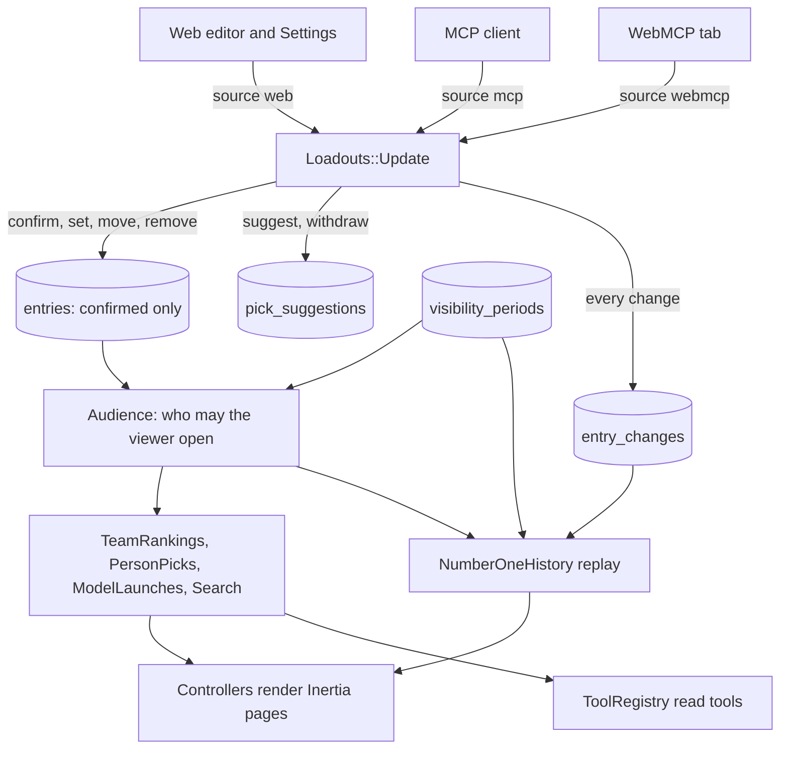
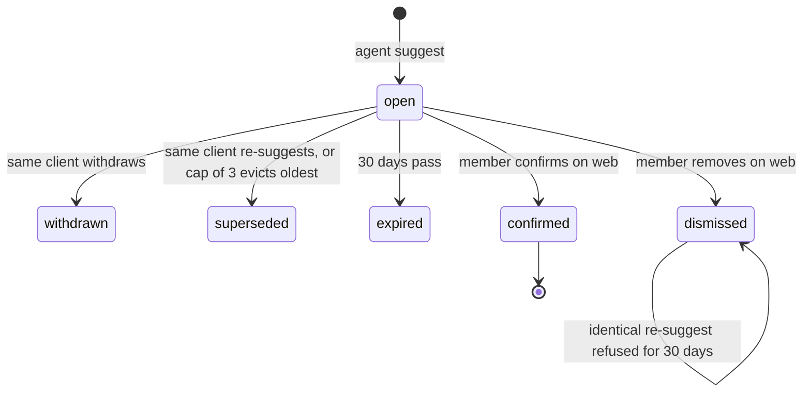
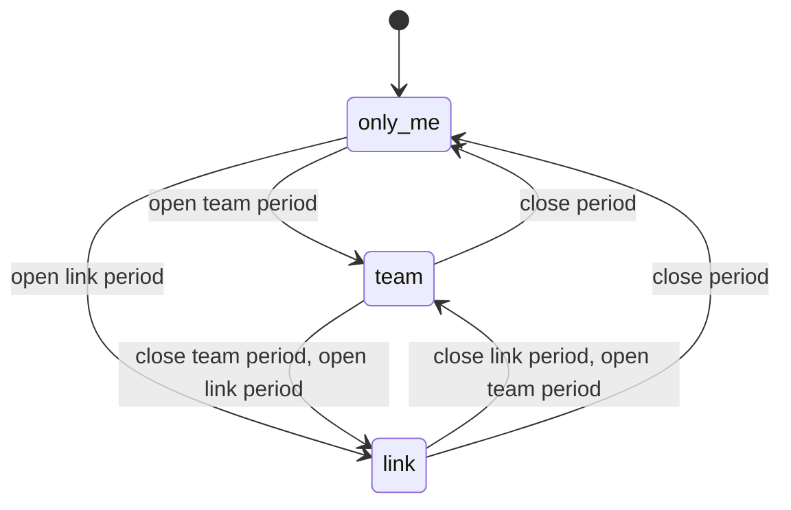
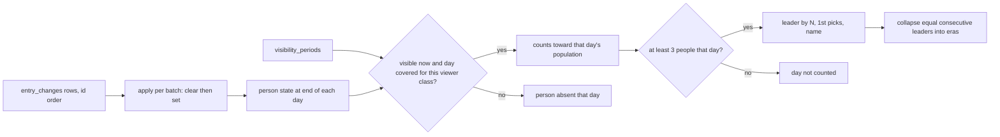
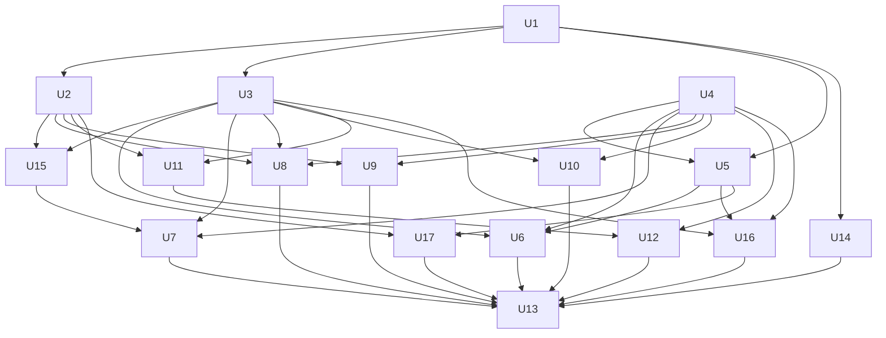

# Every Loadout Redesign - Plan

## Goal Capsule

- **Objective:** Every staff and their circle open one informative, Every-branded page that shows which AI tools and models the team uses for each kind of work. Each person ranks up to three picks per kind (tool, optional model, context size, effort), their own agent's tools can only propose picks that the person confirms on the web, and each person chooses who sees their page (only them by default).
- **Means:** Extend the existing Rails + Inertia app in place: a schema for ranked picks, suggestions and visibility periods, one viewer-aware read layer that feeds both pages and agent tools, and the "Every dark" design system on all eleven surfaces (KTD1, KTD2, KTD3, KTD6).
- **Authority:** Kieran Klaassen owns product decisions. Precedence: the settled decisions in Key Decisions and the KTD annotations, then `docs/design/every-loadout/` (layout, tokens, copy tone), then `PRODUCT.md`, then this plan's defaults. The mocks are layout truth only: their names, counts, dates and takes are placeholders and never ship as data.
- **Stop conditions:** Stop and report if a migration test shows lost rows or a non-empty `PRAGMA foreign_key_check`, or if a settled decision proves infeasible. A gate that cannot run because a tool is missing is named in the PR instead (Verification Contract).
- **Execution profile:** Dependency-driven waves (see Implementation Units): W0 = U1 and U4; W1 = U2, U3, U5, U14; W2 = U6, U8, U9, U10, U11, U15, U16, U17; W3 = U7, U12; W4 = U13. The v1 Ruby stack is red from W0 on because `entries.primary` disappears, and no agent write tool exists between U2 and U11; each unit turns its owned tests green and the full suite is expected green only after U13. Integration hotspots (`config/routes.rb`, `app/tools/tool_registry.rb`, `test/fixtures/*.yml`, `test/test_helper.rb`, `app/frontend/types/index.ts`, the legacy-file list in `app/frontend/test/design_rules.test.ts`) are merged by the orchestrator; units append only their own lines, and each new rate-limited controller defines its own `RATE_LIMIT_STORE` as `McpController` does.
- **Ships via:** the calling pipeline (simplify, review, compound, browser test, commit, PR). Merging stays with Kieran.
- **Open blockers:** None for implementation. One pre-deploy check needs Kieran (Open Question 1).

---

## Product Contract

### Summary

Loadout becomes "the AI tools Every uses": a public-readable, dark, Every-branded directory with a Home table of what the team uses per kind of work, a Kind page per kind, Person and Profile views, and a Rank editor. Tools and models are separate things with their own marks and counts. Agents write suggestions, people confirm. Visibility is Only me, Every team or Anyone with the link.

### Problem Frame

The v1 app has light monogram tiles, one unbounded list of picks per category with a "go-to", a Home that pitches the product, and a map that only Every members can read. The design of record replaces that with a dark Every look, three ranked picks per kind, and an informative team page. The redesign changes what agents may do (propose only), who is counted (only people who chose to share), and what history means (the team's number-one picks over time). Those shifts touch the schema, the single write path, the tool registry and every page, so they land together.

### Key Decisions

Each carries the provenance the user gave during the design session.

- **Visual system is "Every dark".** Governs R1, R3, R4. (session-settled: user-directed — chosen over the light paper theme and the dark stencil "Shadow Board": the light version felt wrong and the user liked dark Every.)
- **Tools and models are separate; a pick is tool + optional model + optional context + optional effort.** Governs R5, R6, R16 to R19. (session-settled: user-directed — chosen over one combined "tool with a model note" field: the team ranks and compares each on its own.)
- **Each person ranks up to three picks per kind; team surfaces show plain counts like "5 of 6 use it".** Governs R6, R15 to R18. (session-settled: user-approved — chosen over Elo, points, medals and per-person scores: six people is too small a sample and the product refuses engagement mechanics.)
- **Home is informative, not marketing.** Governs R16, R17, R20. (session-settled: user-directed — chosen over a hero with steps and an agent pitch: the user said it is not a marketing page.)
- **Agent-added picks are suggestions until the person confirms them.** Governs R9 to R11. (session-settled: user-approved — chosen over auto-accepting agent picks: accuracy and trust.) Conflict call-out: the guarantee holds at the tool level; WebMCP carries the member's session, so a browser agent that drives the page can still press Confirm (KTD10). The plan proceeds as settled and states this limit on the Agents page.
- **Visibility defaults to Only me; the choices are Only me, Every team, Anyone with the link.** Governs R12, R13. (session-settled: user-approved — chosen over defaulting to team visible: private by default.)
- **Real product marks where they exist, a serif initial otherwise.** Governs R2. (session-settled: user-directed — chosen over two-letter pastel monogram tiles: the user asked for real logos.)
- **Planner defaults for what the design leaves open** are recorded under Assumptions and are revisable.

### Actors

- A1. **Member:** anyone signed in with Every. Owns one loadout, picks, confirms, and chooses visibility.
- A2. **Team viewer:** a signed-in member with a verified `@every.to` email.
- A3. **Other signed-in viewer:** a signed-in member who is not on the team.
- A4. **Visitor:** signed out; reads only what "Anyone with the link" members share.
- A5. **Agent:** an MCP client or a WebMCP browser agent acting as one member.
- A6. **Admin:** approves catalog items and sets model launch dates and Vibe Check links.

### Requirements

**Design system**

- R1. All eleven designed surfaces, the admin catalog page, the static error and offline pages, and the PWA colours render in the Every dark system: colour roles, type roles, 12px and 13px minimums, and 2 to 4px corners as in `DESIGN-BRIEF.md`; no light-theme class remains.
- R2. A tool shows a square light mark and a model a round light mark, using a real single-colour mark when the catalog item has one and a serif initial otherwise; monogram tiles disappear from the web and from the share card.
- R3. The Home hero motion is CSS-only with a reduced-motion fallback and a pause control, and all fonts are self-hosted.
- R4. Copy is plain sentence-case; sample copy in the mocks is never persisted or rendered as data.

**Picks and ranking**

- R5. A pick is a tool plus an optional model, an optional context size (`200k`, `1m`) and an optional effort (`low`, `medium`, `high`); tools and models are counted and ranked separately.
- R6. A person holds up to three confirmed picks per kind at ranks 1 to 3, a tool appears at most once per kind, and there are exactly the 11 designed kinds of work.
- R7. Removing a pick keeps ranks contiguous, and the editor offers Move up and Move down, each an atomic swap with the neighbour.
- R8. Every change to confirmed picks is recorded in `entry_changes` with rank, context and effort, so a person's state at any past date can be replayed.

**Suggestions and agent boundary**

- R9. A pick written through MCP or WebMCP is stored as a suggestion, and it appears only to its owner in the Rank editor and owner-scoped reads until the owner confirms it on the web.
- R10. Open suggestions follow bounded rules: at most 3 open per kind (the oldest is superseded); a newer suggestion from the same OAuth client id for the same kind and tool replaces that client's older one (clients are told apart by id, never by display name); an identical suggestion the member dismissed is refused for 30 days; unconfirmed ones lapse after 30 days; placement is decided at confirm time and never overwrites silently.
- R11. Confirming, dismissing, removing, moving or reordering confirmed picks, visibility, handle, bio, history export, account deletion and agent revocation are human-only: no registry tool offers them and the write path refuses them for any source other than `web`.

**Visibility and audience**

- R12. Visibility is `only_me` (default), `team` or `link`. One rule decides whether a viewer may open a person, and every aggregate, name, search hit, PERSON option, profile and share card uses it.
- R13. Narrowing visibility takes effect immediately: the profile and card of a person the viewer may not open return the same not-found result as an unknown handle, and pages and cards that vary by viewer are never shared-cacheable and are revalidated on every request.
- R14. The SHOW filter offers Every team (verified `@every.to` members), Everyone else (the rest of the visible population), and Every subscribers as a disabled stub with no invented data.
- R15. "N of M" has one definition on every surface: M is the people in the selected SHOW class whom the viewer may open and who have at least one confirmed pick; N is the distinct people in that population with the item at any confirmed rank, counted within the kind on Kind surfaces and across all kinds on Overall, launch adoption and search hits.

**Read surfaces**

- R16. Home shows the title "The AI tools Every uses", up to three latest model launches as one-line rows, the What we use table (per kind: most used tool, most used model, counts, last update), the Overall top 10 toggle, SHOW and PERSON filters, a header search, and one bottom call to action that varies by viewer; it has honest empty states.
- R17. Person view is Home with a PERSON selected: their picks per kind, "Team uses" only where their pick differs, and "New in X's loadout" only when a confirmed model is a listed launch.
- R18. The Kind page shows "K of M ranked it", tools and models with N of M and who ranked them 1st, 2nd and 3rd (visible people only), setups by tool+model+context+effort, takes as link-outs to the Vibe Checks of launched models people ranked in that kind, "What we used before" once there are two eras, and a call to action into the editor.
- R19. Profile shows a person's bio, ranked picks with context and effort chips, "N of 11 ranked", a "Not ranked yet" line, Compare with mine, and Copy link.
- R20. Search covers tools, models and people the viewer may see, approved catalog items only, on Home.
- R21. A model appears in Latest launches only when it has a release date and a valid Vibe Check link; the newest is marked NEWEST; no link or date is ever invented.
- R22. "What we used before" is the team's number-one tool and model per kind over time, replayed from `entry_changes`. It counts only people who are currently visible to the viewer and only on days they were sharing at the viewer's level, counts a day only when at least 3 people were sharing, and says that eras reflect who was sharing as well as who switched.

**Editor, onboarding and account**

- R23. The Rank editor shows the 11 kinds with progress ("2 of 3 · 1 to confirm"), three slots with TOOL, MODEL, CONTEXT and EFFORT selects, autosave per slot, Confirm and Remove on suggestions, "Add a tool or model", an agent card that mentions WebMCP, and a line that says who can see the page and links to change it.
- R24. Claim your link takes a handle and a visibility choice, shows the same per-level consequence lines as Settings, then continues to the editor.
- R25. Settings covers a read-only name, bio, three visibility radios whose consequence line says who can find and read the page (including that teammates' connected agents read team-visible picks and that already-unfurled cards cannot be recalled), connected agents with revoke, a history download, and account deletion with a typed confirmation.
- R26. Sign-in copy states what is read (name, photo and email); consent and Agents-page copy about what an agent can and cannot do is generated from one source that matches the tool registry.

**Agents**

- R27. `ToolRegistry` stays the single source for MCP and WebMCP: `suggest_picks` replaces `update_loadout`, `get_my_loadout` is reshaped, and one new read tool, `get_team_rankings`, returns the same data as the pages by calling the same query objects as the acting member.
- R28. After a WebMCP write from the open Rank page, the page reloads its props; agent-facing URLs derive from configuration.

**Share card**

- R29. The share card follows `EveryShare2` (1200x630, top 3 tools and models), is served only for "Anyone with the link", invalidates old cached cards, and the site default card is regenerated.

**Platform**

- R30. The migration keeps every user, session, grant, tool, model and legacy change row except the `other` kind's change rows, adds only the rows it must (baselines, visibility periods), and archives what it drops (picks beyond three, duplicate tools in a kind, notes, the `other` kind's picks and change rows).
- R31. Catalog changes reach production, admin-set launch fields survive `Catalog::Sync`, display hosts come from one configurable source, and the deploy takes a consistent database backup before migrating.
- R32. `bin/rails test`, `npm run check`, rubocop, brakeman, bundler-audit and `db:seed:replant` pass, and the docs describe the new model.

### Acceptance Examples

- AE1. **Covers R15, R16, R18.** Given six people with confirmed picks visible to a team viewer and four of them list Cursor in Coding, when the viewer opens Home and the Coding Kind page, then both show "4 of 6", the Kind header reads "K of 6 ranked it" with K the people with a Coding pick, and the names in "1st for …, 2nd for …, 3rd for …" for Cursor add up to four.
- AE2. **Covers R12, R13, R15.** Given Dan set visibility to Only me, when a colleague opens Home, searches "Dan", or requests `/dan` or Dan's card, then Dan is missing from counts, PERSON and search, and the profile and card return the same not-found result as an unknown handle; Dan himself sees M+1 and a note that his private picks are included.
- AE3. **Covers R9, R10, R11.** Given an agent calls `suggest_picks` for Coding, when a colleague views Home, the profile or the card, then nothing changed; the owner sees "Suggested by <client>" with Confirm in the editor, and confirming places it in the hinted slot if empty, else the first empty slot, else asks which pick to replace.
- AE4. **Covers R22.** Given three people sharing with Every team throughout, and a fourth who shared in March, switched to Only me in May, and shared again in July, when a team viewer reads "What we used before" for Coding, then the fourth person counts for March to May and from July on but not in between; an anonymous viewer never sees a team-only period; a person who is Only me today counts for no day at all.
- AE5. **Covers R21.** Given a model with a release date but no Vibe Check link, when Home renders, then it is not listed as a launch; given a model with both and an `every.to` link, then it appears with a link that opens with `rel="noopener noreferrer"`.
- AE6. **Covers R16.** Given no one has shared, when a visitor opens Home, then there is no hero data and no "0 of 0"; the page shows "Nobody has shared a loadout yet" and the Join Every call to action.
- AE7. **Covers R11, R27.** Given `tools/list` and the WebMCP manifest, when they are inspected, then no confirm, dismiss, remove, move, reorder, visibility, handle, bio, history-export, delete or revoke tool exists, and extra arguments such as `confirmed` or `visibility` fail schema validation.
- AE8. **Covers R30.** Given a database with users, sessions, grants, entries beyond three in a kind, a note and an `other` pick with change rows, when the migrations run, then the counts of users, sessions, grants and tools are unchanged, legacy change rows are preserved except those of `other` (archived and counted), `PRAGMA foreign_key_check` is empty, and 11 kinds remain.
- AE9. **Covers R10.** Given two OAuth clients that both register as "Claude", when each suggests a pick in the same kind, then neither supersedes the other; disconnecting one on the Agents page withdraws only its open suggestions.
- AE10. **Covers R12, R13.** Given any viewer class, when a hidden person's picks, suggestions, visibility (including a past team period), pending catalog items or account change, then that viewer's Home, Kind, Profile, search results, tool outputs and meta tags are byte-identical to before.
- AE11. **Covers R14.** Given `ana@every.to.evil.com`, `a@b@every.to`, `x@sub.every.to`, and an `@every.to` address whose provider claim is not verified, when they sign in, then none is treated as Every team.

### Success Criteria

- A member with a complete loadout in about a minute by hand or by agent, whose agent-proposed picks stay invisible to others until confirmed.
- Every count on Home, Kind, Profile, search and agent tools reconciles against one definition, checked by tests that compare page props with tool output for the same viewer.
- The eleven screens match the mocks in structure, hierarchy and token use at 1440px, and follow the U4 responsive rules at 390px.

### Scope Boundaries

**Deferred to Follow-Up Work**

- Moving the app to `every.to/loadout` (routes, OAuth callbacks, MCP resource URL, share links, `DEPLOYING.md`): this change only makes URLs configurable.
- Dropping the deprecated `users.public` column (needs a safe SQLite table rebuild).
- Session expiry: today's permanent session cookie keeps a departed member signed in until `loadout:remove_member` runs.
- More agent read tools (person picks, model launches, number-one history, team search), agent-proposed removals or reorders, push or polling updates for MCP writes made outside the browser, a read-only OAuth scope, a compare tool.
- A real "Every subscribers" audience once a data source exists.
- Regenerating the marketing screenshots in `docs/screenshots/`.

**Outside this product's identity**

- Points, Elo, medals, streaks, leaderboards of people, nudges.
- Fetching or quoting Vibe Check content: takes are link-outs to sign-in-gated pages.
- Auto-accepting agent picks.

### Dependencies and Sources

- Design of record: `docs/design/every-loadout/README.md`, `DESIGN-BRIEF.md`, `pages/*.dc.html`, `reviews/`.
- Product truth: `PRODUCT.md`, `CONCEPTS.md`, `docs/modules/{serialization,webmcp,frontend,testing,agent-conventions,feature_flags}.md`, v1 plan `docs/plans/2026-09-26-001-feat-loadout-v1-plan.md`.
- Learnings applied: `docs/modules/geneva_drive.md` and `test/migrations/geneva_drive_migration_test.rb` (SQLite rebuild cascades), commit `a2730c5` (NULL-distinct unique index, catalog sync), `docs/solutions/inertia-vite-digest-chdir-race.md` (no `Dir.chdir` on request paths), `docs/residual-review-findings/cursor-loadout-v1-0cbf.md` (email trust).
- Local toolchain: Ruby 4.0.7 and libvips are installed; Node is 22.18 against `.node-version` 24.

---

## Planning Contract

### Repo changes this work owes

Places where the repository still encodes the rejected v1 model. Each is fixed by a named unit. **Conflict report against the settled decisions:** none is infeasible or destructive. Two are worth Kieran's eye: `update_loadout` is renamed to `suggest_picks` rather than extended in place (KTD9), and the confirm boundary is a tool-level guarantee that a browser-driving agent can still cross by clicking (KTD10).

| Repo evidence | Conflict | Owner |
|---|---|---|
| `PRODUCT.md`, `README.md`, `config/catalog.yml` header, `tool_mark.tsx`, `ProfileCard#mark_colors` | "Typographic tiles, not logos" contradicts real marks | U4, U16, U13 |
| `HomeController#index` redirects signed-in members to `/:handle`; `pages/home/index.tsx` is the marketing hero | Home must be the team page for everyone | U6 |
| `users.public` boolean, `MapStats#every_entries` counting private members anonymously | Three-level visibility, only people who shared are counted | U1, U3 |
| `MapsController`, `public_map` Flipper flag, map explainer | Home replaces the members-only map | U6, U7, U13 |
| `entries.primary`, `note`, `Loadouts::Update` ops `set_primary`, `update_note`, `replace_category` | Ranked slots replace go-to and notes | U1, U2 |
| `update_loadout` writes live picks and offers removal, `destructive_hint: true` | Agents may only suggest | U2, U11 |
| `ListCategoriesTool` and `UpdateLoadoutTool` descriptions list 12 kinds including `other` | The design has 11 | U11 |
| `Catalog::Sync` overwrites `released_on` and `family` on every run and only runs from `db:seed`; `Catalog::Merge` edits picks without change rows | Admin launch fields and catalog changes must reach production; merges must keep history complete | U5, U17 |
| Sign-in mock says "only your name and photo" | `email_address` and Every `user_id` are stored | U9 |
| `Sessions::EveryController` refuses only an explicit `email_verified: false`; `User.every_members` is a loose `LIKE`; `admin_email?` ignores verification | "Every team" becomes a read gate for private picks | U1 |

### Assumptions

This run skipped the scoping confirmation, so the bets below are recorded for Kieran to override.

- The owner counts in their own totals and sees a note ("includes your private picks") when their visibility is Only me; colleagues see M without them.
- A tool appears at most once per kind, so a person who runs one tool with several models records one model per tool per kind; models may repeat across slots.
- History (R22) counts a person only on days they were sharing, only while they are still visible to the viewer, and only on days when at least 3 people were sharing.
- "Every team" means a verified `@every.to` email (R14, KTD17).
- v1 is not deployed (`DEPLOYING.md` still lists DNS and the Every OAuth client as one-time steps), so there are no production members or connected agents, `update_loadout` is replaced outright, and picks beyond three, duplicate tools, notes and `other` are dropped and archived. If either is false, keep an alias that only suggests and revoke old grants with `loadout:revoke_agent_grants`.
- Any Every account may rank and be counted under "Everyone else" when they choose "Anyone with the link".
- Only `approved` catalog items appear in aggregates, search, launches and the hero. A pick that uses a member's still-pending item shows to that member with a "Pending review" chip, is invisible to everyone else, and counts only after approval.
- A model is a launch when it has `released_on` and a valid `vibe_check_url` (https, no credentials, default port, host exactly `every.to` or `checks.every.to`, configurable); at most three are listed.
- Staleness reads "Not updated in N weeks" from 6 weeks (coral), in weeks up to 8, then months, in UTC.
- Search lives on Home only and needs 2 or more characters.
- The history download is JSON and includes the person's private-era changes.
- Ranking order everywhere is N descending, then count of 1st picks, then name. Leaders can flip at small M; that is accepted.
- "Move up" and "Move down" text buttons are added to the editor (the mock has none) as the keyboard and reorder path.
- Join Every links to `https://every.to` and All Vibe Checks to `https://checks.every.to`, both held once in `LoadoutHost`.

### Key Technical Decisions

- KTD1. **Suggestions live in their own table; `entries` holds only confirmed picks.** Every reader (aggregates, share card, meta description, search, launches) reads `entries`, so an unconfirmed pick cannot leak by omission. Confirming runs one transaction through `Loadouts::Update` with source `web`.
- KTD2. **`Loadouts::Update` remains the only write path and enforces the boundary by `source`.** `web` may run every operation; `mcp` and `webmcp` may run only `suggest` and `withdraw`; `system` is reserved for migrations and catalog merges. `source` is set by the server per transport and is never an argument. The op enum is split into `WEB_OPERATIONS` and `AGENT_OPERATIONS`, and only the latter builds the tool schema.
- KTD3. **One shared read layer, viewer-aware, feeds pages and tools.** `Audience`, `TeamRankings`, `PersonPicks`, `ModelLaunches`, `NumberOneHistory` and `Search` take `viewer:` and return plain hashes. Controllers and tools are thin serializers over them, which is the parity mechanism and the privacy control. It replaces `MapStats`. The visibility rule itself lives only in `User::Visibility` (`visible_to?`, `User.visible_to`); `Audience` and `ProfileLookup` call it, and a grep gate forbids any other comparison of visibility values.
- KTD4. **Audience and counting rule.** Governs R12 to R15. The population P for a viewer is the users they may open, with at least one confirmed pick, from a SHOW class partition. M is `|P|`. Tool N is distinct people with the tool in the kind; model N counts only picks that have a model. The Kind header reads "K of M ranked it". Setup groups (tool, model, context, effort) count people, so they are bounded by `min(tool N, model N)` and need not sum to either; null context and effort form their own group. Suggestions and pending or hidden catalog items count nowhere. `TeamRankings.item_counts` is the only place N of M is computed; Overall, launch adoption, search hits and the editor's team list all call it.
- KTD5. **Visibility is a plain string column with a table of periods.** `users.visibility` (`only_me`, `team`, `link`) is added with a default; `users` is never rebuilt because a SQLite table rebuild cascade-deletes `entries` and `entry_changes` and nulls `tools.created_by_id` (docs/modules/geneva_drive.md). A `visibility_periods` table (user, level `team` or `link`, `starts_at`, `ends_at`, cascade FK) records every span a person shared. An `after_save` callback on `User` opens the first period when a record is saved with `team` or `link`, and closes the open period and opens the next whenever `visibility` changes, in the same transaction, so no controller or seed can skip it. `visible_to?` fails closed on an unknown value. Validation of the level is a model rule, not a database check, because a check on `users` would rebuild it. `users.public` stays in the database, unread: `User.ignored_columns` includes it so a leftover reader fails loudly, and a later migration drops it.
- KTD6. **Ranked slots with a rank-based unique key.** `entries` gains NOT NULL `rank`, plus `context` and `effort`; `primary` and `note` go away. Unique keys are `(user, category, rank)` and `(user, category, tool)`, both on NOT NULL columns so the NULL-distinct trap from commit `a2730c5` cannot recur. Ranks 1 to 3 and the enums are model validations (a database upper bound would leave no room to swap). SQLite checks unique indexes per row, so `Loadouts::Slots` parks rows at `rank + 10` inside the transaction before assigning final ranks, and a test asserts that no committed row exceeds rank 3. Move up and Move down are one atomic `move_pick` swap. `entries` has no inbound foreign keys (suggestions store a snapshot, KTD18), so one explicit rebuild in one migration is safe. `Loadouts::Update` also rescues `RecordNotUnique`.
- KTD7. **Change rows carry slot state; history is replayed, never snapshotted.** Every row that changes a slot stores the state after the change (tool, model, rank, context, effort) and, for moves and compaction, `from_rank` (a new column); `removed` means the slot is empty. The slot-changing actions are `set`, `moved`, `removed`, `confirmed` and `baseline`; `suggested` and `dismissed` never affect slots. Rows with the same `details.batch` share one timestamp and apply together in `id` order: clear the removed and `from_rank` slots, then set the rest. A person's state is the full replay of their rows. A day counts toward a viewer's history only when the person is currently in that viewer's population (a person who is Only me today counts for nothing), the day falls inside one of the person's `visibility_periods` that the viewer's class may see (team viewers: `team` and `link` periods; other viewers and visitors: `link` periods), and at least 3 people were counted that day; a viewer always sees their own history. Each covered day is sampled at the earlier of end of day and the end of the covering period, and consecutive equal leaders collapse into eras. It is computed on read, because deleting a user deletes their rows and a snapshot would keep their influence. Legacy rows have no rank and are ignored by replay; the migration writes `baseline` rows at the migration timestamp for every migrated user who has picks, whatever their visibility, so a person who later shares replays correctly. The full replay of every fixture person must equal `entries` (tested).
- KTD8. **No cache on aggregates in this change.** With a team of tens, on-read SQLite queries are cheap and a per-viewer-class cache would be a leak risk. Add indexes that serve replay and revisit only with measurements.
- KTD9. **Agent tools mirror page sections, kept small.** `suggest_picks` replaces `update_loadout` (rename outright; a name that says "suggest" is the first guard). `get_my_loadout` is reshaped; `get_team_rankings` is the one new read tool and calls the KTD3 objects as the acting member (overall, or one kind with setups and per-rank names), returning allowlisted fields only (never email, bio or avatar URL; names are truncated to 80 characters and stripped of control and format characters). Read tool descriptions say returned names are data, not instructions. Enum values for context and effort come from one Ruby constant shared with the editor props. Descriptions never enumerate kinds; they point to `list_categories`. New tools are added with `bin/rails g tool`. Person picks, launches, history and team search tools are deferred.
- KTD10. **Confirmation stays outside the registry.** Suggestion rows are immutable: `suggest` always inserts a new row and supersedes the client's earlier one, never editing a listed row. Confirm and dismiss are web controller actions addressed by suggestion id; a confirm request carries the rendered slot and the replaced-pick snapshot and fails with "This changed, review it" on any mismatch, superseded rows cannot be confirmed, no GET confirms anything, and there is no confirm-all. WebMCP carries the member's session authority, so an agent that drives the page can still press Confirm, approve a new OAuth client on the consent page or revoke agents; the Agents page states that limit rather than promising more.
- KTD11. **Marks come from the catalog.** `config/catalog.yml` gains an optional `mark` key that `Catalog::Sync` writes to a nullable `mark` column on `tools` and `ai_models`. The ten Simple Icons SVGs move to `app/frontend/assets/marks/` (key = file stem without the `M_` prefix) so Vite, `ProfileCard` and the Docker image read one copy; keys resolve against a boot-time list of those files, never a path join, and a test allows only `path` and `g` elements. Items without a mark render a serif initial. `hue` and `monogram` stay as vestigial columns.
- KTD12. **Launch and Vibe Check data is admin-owned and validated in the model.** `ai_models.vibe_check_url` is new; `AiModel` validates it (https, no userinfo, default port, lowercased host compared for equality with the allowlist from `VIBE_CHECK_HOSTS`, defaults `every.to` and `checks.every.to`, no suffix match, no wildcards) and re-checks it at render and in tool output, so `Sync`, seeds and the console cannot bypass it. `AiModel.launched` (release date plus valid link) is the one listing rule. `Catalog::Sync` fills `released_on` and `vibe_check_url` only when blank and `admin_edited_at` is nil. No launch data is invented; development seeds mark demo values as demo. Vibe Check links render with the fixed text "Vibe Check" and the accessible name "Vibe Check for <model>".
- KTD13. **Tokens are replaced in place, page by page.** U4 defines the Every dark tokens next to the old ones and keeps the old types and components alive; each surface unit converts its own files; U13 deletes the old tokens, components and types. A `design_rules` test scans `app/frontend` for sizes below the minimums and, until U13, skips a legacy-file list that each unit shrinks. Fonts: Hanken Grotesk via `@fontsource-variable/hanken-grotesk`, Newsreader and Geist Mono as today; the stencil font stays out.
- KTD14. **Hosts are configurable, not moved.** One Ruby helper over `Rails.configuration.x.public_base_url` (default display host `loadout.every.to`) replaces the copies in `OauthServer`, `ProfileLookup` and `config/initializers/omniauth.rb`; the frontend reads the display host from a `public_host` shared prop instead of `HOST` in `lib/handles.ts`, and the mocks' `every.to/loadout` strings are replaced by it; `ToolRegistry::ENDPOINT` and confirm links derive from it. Production sets `config.hosts` from `PUBLIC_BASE_URL` (already required by `config/deploy.yml`), excludes `/up` from host authorization so the proxy health check passes, and enforces the variable at server boot but not while `SECRET_KEY_BASE_DUMMY` is set for `assets:precompile`. (session-settled: user-directed — chosen over moving the app to `every.to/loadout` now: that is a separate deploy task.)
- KTD15. **Search and filters use Inertia partial reloads, not JSON endpoints.** Home reads `show`, `person`, `overall` and `q` from the query string; search re-requests Home with `only: ['search']`, `preserveUrl` and the current filters, with `search` an `InertiaRails.optional` prop. Searches are rate limited per IP. The history download is the single sanctioned file response beside `/webmcp/tools`.
- KTD16. **Catalog changes deploy through the entrypoint, behind a backup.** `bin/docker-entrypoint` takes a consistent SQLite backup (`.backup`, file mode 0600) when migrations are pending, then runs `db:prepare`, then `Catalog::Sync` as a non-fatal step (a failure is logged, the server still boots; `db:seed:replant` in CI validates `catalog.yml`). The migration removes `other` explicitly because Sync never deletes. Rollback to the previous image is not possible after the schema change; rollback means restoring the backup. The backup and the migration archive hold emails and private notes, so DEPLOYING.md says to delete them once the deploy is verified.
- KTD17. **"Every team" means a verified `@every.to` email, fail-closed.** `users.email_verified` (boolean, default false) is assigned from the provider claim on every sign-in (true only when the claim is exactly `true`), so a later unverified address clears it; a nil claim signs the person in but never makes them team. One Ruby predicate and one SQL scope (`User.every_members`) share the definition: exactly one `@`, domain exactly `every.to`, case-insensitive, verified; tests cover lookalikes. `ADMIN_EMAILS` grants admin only when `email_verified` is true. Dev login sets it to true.
- KTD18. **Suggestions identify agents by OAuth client id and snapshot what they replace.** A suggestion stores `oauth_client_id` (null for WebMCP), `client_name`, and, for a change to an occupied slot, a snapshot (`replaces_rank`, `replaces_tool_id`, `replaces_ai_model_id`) instead of a foreign key to `entries`. Supersede keys on the client id. `Loadouts::Suggestions.withdraw_for_client` is called explicitly from `AgentsController#destroy` (which revokes with `update_all`), `OauthGrant#revoke!` and both rake tasks. The client id reaches `Loadouts::Update` through the MCP server context next to `client_name`. Consent shows a real mark only for a client whose redirect URI is https and whose lowercased host equals an entry in `Agents::KnownClients`; loopback and private-use-scheme redirects always get an initial and the redirect host. Client names have format characters (`\p{Cf}`) stripped.
- KTD19. **Viewer-varying responses are never shared-cacheable.** Home, Kind, Profile and search responses set `Cache-Control: private` and `Vary: Cookie`. The share card is rendered for an explicit visitor audience (never `Current.user`), is served with revalidation (`no-cache` plus an ETag derived from the card's inputs and visibility) rather than `public, max-age`, and its cache key adds a content digest. Unauthorised and unknown handles resolve through the same query and return deep-equal props.

### High-Level Technical Design

**Write, read and audience flow.** Writers converge on one service; readers converge on one viewer-aware layer.

**Suggestion lifecycle.** Agents can drive only the entry into `open` (suggest) and the moves from `open` to `withdrawn` or `superseded`; the member alone confirms or dismisses.

**Visibility periods and what history may show.** Every change closes the open period and opens the next; only sharing spans are recorded.

**Replay for one viewer.** A day counts for a person only when they are visible to the viewer today and a period the viewer's class may see covers it.

**Viewer classes and populations.**

| Viewer | Population P (counted and named) | Extras |
|---|---|---|
| Owner | others they may open, plus self | own suggestions; note when their picks are private |
| Team (verified `@every.to`) | `team` and `link` users, plus self | PERSON list, names |
| Other signed-in | `link` users, plus self | editor and call to action |
| Visitor | `link` users only | Home meta and OG use this class |

A `show=` or `person=` value the viewer may not use behaves like an unknown value and falls back to the default with no error. SHOW partitions P: Every team = verified `@every.to`, Everyone else = the remainder. A `team` or `link` user with no confirmed picks is openable but not in P or PERSON, and their profile shows an empty state.

### Contracts

**`Loadouts::Update` operations.**

| Operation | Source | Arguments | Effect |
|---|---|---|---|
| `set_pick` | web | category, rank, tool, model?, context?, effort? | Fill or edit one slot (writes a `set` row); a tool already in another slot of the kind is a readable error |
| `remove_pick` | web | category, rank | Remove and compact |
| `move_pick` | web | category, rank, direction (`up`, `down`) | Atomic swap with the neighbour |
| `confirm` | web | suggestion id, rank?, expected slot and replaced-pick snapshot | Place at the hinted slot if empty, else the first empty slot, else the explicit rank (R10, AE3); reject a stale snapshot per KTD10; rank required when no slot is empty |
| `dismiss` | web | suggestion id | Close as dismissed |
| `suggest` | any | category, tool, model?, context?, effort?, rank hint? | Insert a new suggestion; supersedes that client's earlier one for the same kind and tool |
| `withdraw` | any | suggestion id | Close as withdrawn (own suggestions only) |

**Shared shapes** (Ruby props and TS types agree; U4 writes the shared TS side, page-specific props live in their page file).

| Shape | Fields |
|---|---|
| Mark item | `slug`, `name`, `kind` (`tool` or `model`), `mark` (key or null), `pending` |
| Count | `n`, `of` |
| Pick | `rank`, `tool` (Mark item), `model` (Mark item or null), `context`, `effort` |
| Suggestion | `id`, `category`, `tool`, `model`, `context`, `effort`, `slot_hint`, `replaces` (rank and item snapshot or null), `suggested_by` (client name), `suggested_at` |
| Era | `from`, `to` (null for the current era), `tool` (Mark item), `model` (Mark item) |
| Launch | `model` (Mark item), `released_on`, `vibe_check_url`, `newest`, `adoption` (Count), `mostly_in` (Mark item or null) |
| `current_user` | existing fields with `visibility` in place of `public`, plus `email_verified` |
| Shared props | existing plus `public_host` |

**Page prop contracts** (owners build the Ruby side and the page-local TS type together).

| Surface | Owner | Fields |
|---|---|---|
| Home | U6 | `filters` (show, person, overall, q), `people` (PERSON options for the current SHOW partition), `launches` [Launch], `hero` (`{boards: up to 3 {category, picks: up to 3 {rank, tool, model}}, people, picks, last_update_at}` or null; absent on Person view), `rows` [{category, top_tool {item, count, runner_up}, top_model {…}, ranked (Count), last_update_at, stale}], `overall` {tools, models} (top 10 each), `search` (optional: `{query, people: [{handle, name}], items: [{kind, item, kinds: [{category, count}]}]}`), `cta` {label, href}, `notice` |
| Person view | U6 | Home plus `person` {handle, name, avatar_url, ranked_count, kinds [{category, picks [Pick], team_uses}], new_in_loadout [Launch]} |
| Kind | U7 | `category`, `ranked` (Count as K of M), `tools` [{item, count, by_rank {1,2,3: names}}], `models` [same], `setups` [{tool, model, context, effort, count}], `takes` [{model, url}], `eras` (null under two), `cta` {label, href} |
| Profile | U10 | PersonPicks output plus `bio` (Profile only), `viewer_can_compare`, `you` ({category: [Pick]} of the viewer's confirmed picks), `copy_url` |
| Editor | U8 (owner picks by U2, `team_top` by U8) | `kinds` [{category, picks, suggestions, to_confirm}], `catalog` {tools, models} (each item with `suggested_for` kinds), `enums` {context, effort}, `selected_kind`, `visibility`, `team_top` {category => {tools: [{item, count, yours_rank}], models: [{item, count, yours_rank, launched}]}} |

### Repo files that change with these contracts

Tests currently pinned to v1 behaviour are reassigned to the unit that replaces their subject: `home_controller_test` (U6), `maps_controller_test` and `map_stats_test` (deleted by U6 and U3), `profiles_controller_test` (U10), `profile_card_test` and `profile_cards_controller_test` (U16), `settings_controller_test`, `onboarding_controller_test` (U9), `loadouts_controller_test`, `services/loadouts/update_test` (U2), `entry_change_test` (U14), `services/catalog/*` and `admin/catalog_items_controller_test` (U5, U17), `tool_registry_test`, per-tool tests, `mcp_oauth_test`, `webmcp_test`, `agents_controller_test` (U11), `user_handle_availability_test` (U1), `pwa_test` (U4), `tool_generator_test` (U11). Frontend tests move with their components.

---

## Implementation Units

| U-ID | Title | Key files | Depends on |
|---|---|---|---|
| U1 | Data model, visibility, host helper and fixtures | `db/migrate/*`, `app/models/*`, `test/fixtures/*` | none |
| U2 | Ranked-pick write path and suggestions | `app/services/loadouts/*`, `loadouts_controller.rb` | U1 |
| U3 | Audience and read layer | `app/queries/*` | U1 |
| U4 | Every dark design foundation | `application.css`, `components/`, `types/index.ts` | none |
| U5 | Catalog, marks, launch data and deploy path | `config/catalog.yml`, `catalog/sync.rb`, `bin/docker-entrypoint` | U1, U4 |
| U6 | Home, Person view and search | `home_controller.rb`, `pages/home/*` | U3, U4, U5 |
| U7 | Kind of work page | `kinds_controller.rb`, `pages/kinds/*` | U3, U4, U15 |
| U8 | Rank editor | `pages/loadout/edit.tsx`, `components/rank/*` | U2, U3, U4 |
| U9 | Claim your link, Settings and Sign in | `onboarding_controller.rb`, `settings_controller.rb`, `pages/auth/*` | U1, U2, U4 |
| U10 | Profile page and not-found | `profiles_controller.rb`, `pages/profiles/*` | U3, U4 |
| U11 | Agent tools and trust copy source | `app/tools/*`, `agents_controller.rb`, `mcp_controller.rb` | U2, U3 |
| U12 | Agents and consent pages | `pages/agents/*`, `pages/oauth/*` | U4, U11 |
| U13 | Cleanup, docs, parity tests and full gates | deletions, `docs/*`, `test/integration/*` | all |
| U14 | Change-row narration | `app/models/entry_change.rb` | U1 |
| U15 | Number-one history | `app/queries/number_one_history.rb` | U1, U2, U3 |
| U16 | Share card | `app/models/profile_card.rb`, `profile_cards_controller.rb` | U3, U4, U5 |
| U17 | Catalog merge on ranked picks | `app/services/catalog/merge.rb` | U1, U2, U5 |

Wave rule: a unit runs its own test files plus any file it touches, and its own Vitest files (`npx vitest run <path>`). `npm run check` stays green throughout because shared v1 components, libs and types stay until U13. Each surface unit reads its mock in `docs/design/every-loadout/pages/` and its notes in `reviews/` before building, and treats mock data as placeholder.

### U1. Data model, visibility, host helper and fixtures

- **Goal:** Land the schema, models, visibility rule, host helper and fixture universe every other unit builds on.
- **Requirements:** R5, R6, R8, R12 to R14, R30, R31, KTD5, KTD6, KTD7, KTD14, KTD16, KTD17, KTD18.
- **Dependencies:** none.
- **Files:**
  - Create: `db/migrate/*_add_visibility_and_periods.rb`, `*_rework_entries_for_ranked_picks.rb`, `*_add_slot_state_to_entry_changes.rb`, `*_create_pick_suggestions.rb` (strictly later than the entries rebuild), `*_add_mark_and_launch_fields_to_catalog.rb`, `app/models/pick_suggestion.rb`, `app/models/visibility_period.rb`, `app/models/user/visibility.rb`, `app/models/loadout_host.rb`
  - Modify: `db/schema.rb`, `app/models/{user,entry,entry_change,ai_model,tool,category,oauth_client}.rb`, `app/models/user/{every_identity,handle}.rb`, `app/models/concerns/catalog_item.rb`, `app/controllers/concerns/{profile_lookup,oauth_server}.rb`, `app/controllers/inertia_controller.rb`, `app/controllers/sessions/every_controller.rb`, `app/controllers/dev_login/*`, `config/initializers/omniauth.rb`, `config/environments/production.rb`, `test/fixtures/{users,entries,categories,tools,ai_models,pick_suggestions,entry_changes,visibility_periods}.yml`
  - Test: `test/migrations/every_loadout_redesign_migration_test.rb`, `test/models/{user,entry,pick_suggestion,visibility_period,ai_model,oauth_client}_test.rb`, `test/models/user_handle_availability_test.rb`, `test/controllers/sessions/every_controller_test.rb`
- **Approach:**
  - Users: plain `add_column` for `visibility` (default `only_me`) and `email_verified` (default false); create `visibility_periods`; backfill `public true` with a handle and `onboarded_at` to `link` with one `link` period at the migration timestamp. Never rebuild `users`; write explicit `up` and `down` (down uses native `DROP COLUMN` or raises `IrreversibleMigration`). Add `public` to `User.ignored_columns`; fixtures drop `public:`.
  - Entries, in one migration with SQL only: archive dropped rows to `storage/migration_archive/*.json` (mode 0600); delete `other` picks and their `entry_changes` rows, then the category, and scrub `other` from member-created `category_slugs`; dedupe tools per kind (keep the best); assign rank with a window function (`primary` first, then `created_at`, then `id`); trim beyond 3; create the new table, copy, drop, rename, add the two unique indexes; write a `baseline` row for every user who has picks, bound to the same timestamp as the `link` periods; assert counts, `foreign_key_check` and `integrity_check` in the migration.
  - Entry changes: add nullable `rank`, `from_rank`, `context`, `effort`, an index serving replay, and extend `ACTIONS` (`set`, `moved`, `confirmed`, `suggested`, `dismissed`, `baseline`, keeping legacy actions readable; `set` is what `set_pick` writes when it fills or edits a slot) and `SOURCES` (`system`).
  - `pick_suggestions`: cascade FK to users; category, tool, model, context, effort, `slot_hint`, snapshot columns, `oauth_client_id`, `client_name`, `status`, `resolved_at`; named CHECKs on status, context, effort. `User has_many :pick_suggestions, :visibility_periods` with `dependent: :delete_all`.
  - Catalog: nullable `mark` on `tools` and `ai_models`, `vibe_check_url` on `ai_models`; `AiModel` gets the URL validator and `launched` scope (KTD12); `to_prop` gains `mark` and `kind`.
  - `User::Visibility` implements KTD5 (`visible_to?`, `User.visible_to`, the `after_save` callback, fail-closed); `every_member?` and `User.every_members` implement KTD17; sign-in assigns `email_verified` from the claim each time; `admin_email?` requires it. `RESERVED` handles gain `kinds`.
  - `LoadoutHost` is the one Ruby helper for base URL, display host and the Join Every and All Vibe Checks URLs (KTD14); `User::Handle` messages, `OauthServer`, `ProfileLookup` and `omniauth.rb` use it; the `public_host` shared prop and `current_user` shape (`visibility`, `email_verified`) are added; `production.rb` sets `config.hosts` with the `/up` exclusion and boot-time enforcement.
  - `OauthClient` normalization strips `\p{Cf}`. Fixture universe: at least six users across the four viewer classes (a verified team `link` user, a verified team `team` user, a verified team `only_me` user, a non-team `link` user, an unverified `@every.to` user, a signed-in non-team user), ranked entries, one launched model, one open suggestion, periods matching each visibility including one hidden user with a past team period.
- **Execution note:** Write the populated-migration test first; it is the guard for data loss.
- **Patterns to follow:** `test/migrations/geneva_drive_migration_test.rb`; commit `a2730c5` for index reasoning.
- **Test scenarios:**
  - Covers AE8. Build the pre-state by running the real migrations up to `20260926230200`, populate users, sessions, grants, tools with `created_by_id`, entries beyond three with a `primary` and a note, duplicate tools in a kind, and `other` picks with change rows; after migrating, counts of users, sessions, grants and tools are unchanged, legacy change rows survive except the archived `other` ones, `PRAGMA foreign_key_check` and `integrity_check` are clean, 11 kinds remain, and the migrated `sqlite_master` matches a schema-loaded database.
  - A user with four picks in a kind and a `primary` on the second keeps three picks with the primary at rank 1; ranks are contiguous; dropped picks and notes are in the archive file with counts; a legacy `only_me` user gets a baseline and, after switching to `team`, their replay equals `entries`.
  - `public true` with a handle becomes `link` with one `link` period; `public false` becomes `only_me` with no period.
  - `visible_to?` returns the right answer for owner, team, other signed-in and nil viewers across all levels and fails closed on an unknown value.
  - Creating a user with `visibility: "link"` yields exactly one open `link` period; changing `visibility` through `update`, `update!` and a controller path closes and opens periods correctly, including `link` to `team` to `only_me` to `team`.
  - Covers AE11. `every_member?` and `User.every_members` agree on `ana@every.to`, and reject `ana@every.to.evil.com`, `a@b@every.to`, `x@sub.every.to`, mixed-case lookalikes and an unverified claim; a nil claim signs in but is not team; a second sign-in with a nil claim clears earlier team status; an `ADMIN_EMAILS` address with a nil claim is not admin.
  - Entry validations: a rank outside 1 to 3 is rejected at model level; a second row at the same rank and the same tool twice in a kind are rejected at model and database level.
  - `AiModel` rejects `http://`, userinfo, a port, `evil-every.to`, `every.to.evil.com`, `every.to@evil.com`, a trailing dot and backslash forms; `launched` needs both fields.
  - `OauthClient` names lose bidi and other format characters.
  - `LoadoutHost` defaults the display host and honours `PUBLIC_BASE_URL`; handle-availability messages use it; the production host list allows `/up` with a container-IP Host header.
  - Reading `user.public` raises (ignored column).
- **Verification:** Migration and model tests pass; `bin/rails db:migrate` on a copy of the dev database succeeds and leaves `foreign_key_check` empty.

### U2. Ranked-pick write path and suggestions

- **Goal:** One service that places, moves, removes, suggests and confirms picks and records complete change rows.
- **Requirements:** R6 to R11, R8, KTD2, KTD6, KTD10, KTD18.
- **Dependencies:** U1.
- **Files:**
  - Modify: `app/services/loadouts/update.rb`, `app/services/loadouts/presenter.rb`, `app/controllers/loadouts_controller.rb`, `app/controllers/agents_controller.rb` (destroy), `app/models/oauth_grant.rb` (`revoke!`), `app/tools/tool_registry.rb` (remove the `update_loadout` entry and instruction sentence), `db/seeds/development.rb`, `config/routes.rb` (loadout lines)
  - Create: `app/services/loadouts/slots.rb`, `app/services/loadouts/suggestions.rb`
  - Delete: `app/tools/update_loadout_tool.rb`, `test/tools/update_loadout_tool_test.rb`
  - Test: `test/services/loadouts/{update,slots,suggestions,presenter}_test.rb`, `test/controllers/{loadouts,agents}_controller_test.rb`
- **Approach:**
  - Implement the operations in Contracts. Non-web sources calling a web operation raise before any write. `Loadouts::Update` takes an `oauth_client_id:` keyword next to `client_name`.
  - `Slots` owns rank arithmetic (place at next free rank, remove with compaction, swap through parked ranks) and writes slot-state rows sharing one batch id and one timestamp (KTD7). `Update` rescues `RecordNotUnique`.
  - `Suggestions` owns R10: the hint is only a hint; at confirm time use it if empty, else the first empty slot, else require an explicit slot to replace; a change to an occupied slot stores the snapshot and confirm compares it; identical to a confirmed pick returns a no-op message; supersede keys on the OAuth client id; cap of 3 open per kind; 30-day dismissal memory and lazy 30-day expiry (resolved rows are kept); superseded and duplicate suggestions write no `entry_changes` row. `withdraw_for_client(user:, oauth_client:)` withdraws a client's open suggestions and is called from `AgentsController#destroy` and `OauthGrant#revoke!`.
  - `suggested`, `dismissed` and `confirmed` rows carry `source` and `client_name`; `confirmed` rows record the original suggester in `details`.
  - Unknown tool or model names from any source create `pending` catalog items as today; non-web sources are capped at 5 new pending items per user per day.
  - Web controller: `PATCH /loadout` takes slot operations; `POST /loadout/suggestions/:id/confirm` and `DELETE /loadout/suggestions/:id` are the human-only actions; strong parameters include `rank`, `context`, `effort` with a round-trip test. `loadout_updated_at` moves only on confirmed changes.
  - `Presenter` becomes a thin owner wrapper (confirmed picks built from `Entry`, open suggestions with the target resolved, progress counts); U8 rewires it to the shared `PersonPicks` builder.
  - Deleting `update_loadout_tool.rb` keeps `ToolRegistry` loadable once the old operation constants go; `ApplicationTool` and the remaining tools are finished by U11.
  - Seeds: six demo members with mixed visibility, ranked picks with contexts and efforts, two open suggestions, and demo launch dates and links on three models, labelled as demo.
- **Technical design:** After "remove rank 2" of three, the batch is `removed(rank 2, X)` plus `moved(rank 2 := Y, from_rank 3)`; replay clears slots 2 and 3, then sets slot 2. A swap is two `moved` rows in one batch.
- **Patterns to follow:** `test/services/loadouts/update_test.rb` helper style; `ApplicationTool::Error` becoming `isError`.
- **Test scenarios:**
  - Covers AE3. `suggest` from `mcp` leaves `entries` and `loadout_updated_at` unchanged; `confirm` from `web` places the pick at the hinted empty slot, else the first empty slot.
  - `confirm` with all three slots full and no explicit slot returns a "choose which pick to replace" error and changes nothing.
  - `confirm` with a stale snapshot (the slot changed since render) fails with "This changed, review it"; a superseded suggestion cannot be confirmed.
  - A human-only operation with source `mcp` or `webmcp` raises before any write.
  - `move_pick` swaps ranks 1 and 2 under the unique indexes with a full kind, writes two `moved` rows in one batch, and no committed row exceeds rank 3.
  - Removing rank 2 of three compacts to ranks 1 and 2 and records `removed` plus `moved` in one batch; a fourth pick is rejected with a readable message; a tool already in another slot is a readable error.
  - Covers AE9. Two clients named "Claude" suggesting in one kind do not supersede each other; the same client suggesting the same tool again supersedes its earlier open suggestion; a fourth open suggestion supersedes the oldest; disconnecting a client through `DELETE /agents/:id` and through `OauthGrant#revoke!` withdraws only that client's open suggestions.
  - After dismissal, an identical suggestion within 30 days is refused with "dismissed on <date>"; after 31 days it is accepted; an open suggestion older than 30 days is treated as expired.
  - Suggesting a tool already confirmed in the kind with different context targets that slot as a change; identical values return a no-op message.
  - After a confirm, other open suggestions that now duplicate the result are cleared.
  - An agent naming an unknown tool creates a pending item once; the sixth in a day is refused.
  - Controller: `PATCH /loadout` persists `rank`, `context` and `effort`; unknown fields are dropped without error; confirm and dismiss require the owner and are POST/DELETE only.
  - The tool registry loads and lists no `update_loadout` after this unit.
- **Verification:** Service and controller tests pass; a `rails runner` script shows suggestion rows never appear in `Entry` queries.

### U3. Audience and read layer

- **Goal:** Query objects that answer every "who may see, and what counts" question once.
- **Requirements:** R12 to R15, R17 to R21, KTD3, KTD4.
- **Dependencies:** U1.
- **Files:**
  - Create: `app/queries/{audience,team_rankings,person_picks,model_launches,search}.rb`, `test/queries/*_test.rb`
  - Delete: `app/queries/map_stats.rb`, `test/queries/map_stats_test.rb`
- **Approach:**
  - `Audience`: resolves viewer class through `User::Visibility` only, normalizes `show` and `person`, builds P and M (KTD4), and offers the single ranking comparator (N descending, 1st-pick count, name). Anything that names or counts a person goes through it. Owner-only data is added by the caller, never by the population.
  - `TeamRankings`: per-kind rows for Home (top tool, top model, counts, one runner-up per cell, last update, stale flag), the hero boards, Overall top 10 (distinct people across kinds), kind detail (tools and models with N of M, per-rank names, setups, "K of M ranked it", "mostly in <tool>" only when N is 2 or more), the editor's `team_top`, and `item_counts`.
  - `PersonPicks`: a person's ranked picks by kind (pending items hidden from others), "Team uses" only where the person's pick differs (compared with the most used item of the current SHOW population), ranked and unranked kinds, "New in X's loadout".
  - `ModelLaunches`: `AiModel.launched`, newest first, max 3, adoption via `item_counts`.
  - `Search`: people, tools, models; 2-character minimum; `LIKE` with `sanitize_sql_like`; viewer-scoped people; approved items only; each tool or model hit lists the kinds it is ranked in with `item_counts`.
  - Forced `show=subscribers` falls back to Every team with a notice (the stub is a constant `Audience::SUBSCRIBERS_AVAILABLE = false`, no feature flag, because a flag that gates nothing is forbidden by `docs/modules/feature_flags.md`).
  - Outputs are plain hashes with fixed key sets and never include email, bio or avatar URL of people beyond the profile fields in the contracts.
- **Patterns to follow:** `MapStats` grouped-SQL style; `Admin::CatalogItemsController#filtered_items` for `LIKE`.
- **Test scenarios:**
  - Covers AE1. For each viewer class, M and every N on Home rows, Overall, launches and the Kind detail use the same M; on a Kind detail the per-rank names for an item union to its N.
  - Covers AE2. An `only_me` person is absent from counts, PERSON, search and named lists for others, present with the note for the owner; an unknown `person=` and a not-visible `person=` produce identical output.
  - A person with `team` visibility and no picks is not in P or PERSON.
  - Forced `show=subscribers` returns the Every team result and a notice.
  - Setup groups: counts are people, a person may appear in two setups, null context and effort form their own group, and setup N is at most `min(tool N, model N)`.
  - A pick without a model adds to the tool count and to no model row.
  - Only `approved` items count; another member's pending item is absent from every other viewer's output including that member's slot on a profile; approving it counts retroactively.
  - Ties: equal N breaks by 1st-pick count then name.
  - Covers AE5 and AE6. Launches need both fields and a valid link; an empty population returns zero counts with a reason, not `0 of 0`.
  - Search: a two-character minimum, no results for another member's pending item, a `%` in the query is not a wildcard, a name containing instruction-like text comes back as plain data.
  - Key-set tests: each output has exactly its contract keys and no `email_address`, `bio` or `avatar_url` outside the profile fields.
- **Verification:** Query tests pass; a fixture-driven matrix test covers viewer class by visibility level.

### U4. Every dark design foundation

- **Goal:** The tokens, fonts, layout, marks, primitives and responsive rules every surface builds on, plus the shared TypeScript shapes.
- **Requirements:** R1 to R3, KTD11, KTD13, KTD14.
- **Dependencies:** none.
- **Files:**
  - Modify: `app/frontend/entrypoints/application.css`, `app/views/layouts/application.html.erb`, `app/frontend/components/{app_shell,wordmark,button,avatar,connect_agent_card}.tsx`, `app/frontend/types/index.ts` (append, keep old types), `app/frontend/test/picker_fixtures.ts` (add new builders), `package.json`, `package-lock.json`, `config/initializers/pwa.rb`, `public/{icon.svg,400.html,404.html,406.html,422.html,500.html,offline.html}`
  - Create: `app/frontend/components/{mark,chip,count,section_label}.tsx`, `app/frontend/assets/marks/*.svg`, `app/frontend/assets/every-logo.svg`, `app/frontend/lib/{marks,public_host}.ts`, `app/frontend/test/design_rules.test.ts`
  - Test: `components/{mark,button,app_shell,connect_agent_card}.test.tsx`, `test/controllers/pwa_test.rb`
- **Approach:**
  - Define the `@theme` tokens from `DESIGN-BRIEF.md` (page `#020202` with a faint dot grid, card `#111111` with `#2a2a2a` border, text `#fdfaf7` / `#d0d0d0` / `#8c8d91`, sky `#9ce5f5`, yellow `#f6b90f`, coral `#ff7765`, 2 to 4px radii, 12px and 13px minimums) beside the old tokens (KTD13).
  - `Mark` renders a tool as a square light tile and a model as a round tile with the dark single-colour SVG for the item's `mark` key (resolved through `lib/marks.ts`, `import.meta.glob` with `?raw`), else a serif initial.
  - `AppShell`: Every logo with italic sky "Loadout", nav Home, Your loadout, Agents, Settings, avatar menu; the Home header variant carries the search slot; the footer lockup renders `public_host`, never the mocks' `every.to/loadout`. `Button`: sharp 2px sky primary, bordered secondary. `connect_agent_card.tsx` is restyled here so the editor and the Agents page share it.
  - **Responsive rules** for all surfaces: one breakpoint at 768px; below it the header shows the logo, the avatar menu and a Menu button that reveals the four nav links (and the search field on Home); three-column tables (What we use, Person view, Profile) and the launch and setup rows become stacked cards with the column label above each value; slot fields sit in a 2x2 grid; the editor kind sidebar becomes a labelled select above the slots; the eras timeline becomes a vertical list; the hero moves below the filters at full width; interactive targets are at least 44px. Surface units cite these rules in their Verification.
  - **Form controls:** `color-scheme: dark` on the root, explicit background and colour on `option` and `optgroup`, and one shared 2px sky `:focus-visible` outline (3px offset) for input, select, textarea and the wrapper of visually hidden radios.
  - `types/index.ts`: append the shared shapes from Contracts (Mark item, Count, Pick, Suggestion, Era, Launch, `current_user`, `public_host`); `lib/public_host.ts` reads the shared prop.
  - `design_rules.test.ts` fails on arbitrary font sizes below 12px (mono labels) or 13px in `app/frontend` source outside a legacy-file list that each unit shrinks and U13 asserts empty.
  - Add Hanken Grotesk through fontsource and keep Inter until conversion finishes.
- **Patterns to follow:** existing `@theme` block and component classes in `application.css`; Vitest tests mock `@inertiajs/react` locally.
- **Test scenarios:**
  - `Mark` renders a square tile for a tool and a round tile for a model, renders the SVG when `mark` resolves, renders the first letter in the serif face when it does not, and never renders two letters.
  - `Button` primary uses the sky token and secondary does not; both have 2px corners.
  - `AppShell` shows the four nav links for a signed-in user and Sign in for a visitor, exposes the search slot on Home, renders the footer from `public_host`, and shows the Menu button at phone width.
  - Every SVG in `assets/marks/` contains only `path` and `g` elements.
  - Shared select and radio-card styles carry the focus class; the root declares a dark color scheme.
  - `design_rules` flags a `text-[11px]` fixture string and passes the shipped sources outside the legacy list.
  - `pwa_test` asserts the new theme and background colours.
- **Verification:** `npm run check` passes; the layout body uses the dark tokens; `public/*.html` render dark when opened directly.

### U5. Catalog, marks, launch data and deploy path

- **Goal:** A catalog of 11 kinds with marks, admin-managed launch data that sync cannot overwrite, and a deploy path that applies catalog changes safely.
- **Requirements:** R1 (admin page), R2, R21, R31, KTD11, KTD12, KTD16.
- **Dependencies:** U1 (columns), U4 (admin page restyle).
- **Files:**
  - Modify: `config/catalog.yml`, `app/services/catalog/sync.rb`, `app/controllers/admin/catalog_items_controller.rb`, `app/frontend/pages/admin/catalog.tsx`, `bin/docker-entrypoint`, `lib/tasks/loadout.rake`, `.env.example`
  - Test: `test/services/catalog/sync_test.rb`, `test/controllers/admin/catalog_items_controller_test.rb`, `test/lib/tasks/loadout_test.rb`
- **Approach:**
  - `catalog.yml`: remove `other`; add `mark:` using the file-stem keys (claude, claudecode, cursor, openai, perplexity, googlegemini, elevenlabs, suno, rive, google) by maker or name (Anthropic models and Claude to `claude`, Claude Code to `claudecode`, ChatGPT, Codex and GPT models to `openai`, Gemini items to `googlegemini`, other Google items to `google`); a test asserts every key has an SVG and every SVG is referenced. Quote short strings that YAML reads as booleans and keep `permitted_classes: [Date]`.
  - `Sync`: writes `mark`; fills `released_on` and `vibe_check_url` only when blank and `admin_edited_at` is nil; still skips member-created items.
  - Admin form permits `released_on` and `vibe_check_url` (validation lives on `AiModel`) and sets `admin_edited_at`; admin item props drop per-item usage counts and show the creator only for pending items, and the add-item form says admins review new tools and models. `VIBE_CHECK_HOSTS` is read from the environment and documented; `config/deploy.yml` is not changed.
  - `bin/docker-entrypoint`: consistent SQLite `.backup` when migrations are pending, then `db:prepare`, then a non-fatal `Catalog::Sync` (KTD16).
  - Rake: `loadout:remove_member EMAIL=` reuses the delete path, revokes the person's sessions and grants, and withdraws their suggestions via `withdraw_for_client`; `loadout:revoke_agent_grants` revokes all grants (for the case where old grants exist).
- **Test scenarios:**
  - Sync writes `mark`, does not overwrite an admin-set `released_on` or `vibe_check_url`, and fills blanks on first run; running it twice is idempotent; `other` no longer appears.
  - A catalog with an unquoted boolean-like monogram fails the seed test.
  - The admin form rejects `http://` and a non-allowlisted host, accepts `https://checks.every.to/...`, and sets `admin_edited_at`; item props carry no usage counts.
  - Every `mark` key maps to a file and every file is referenced.
  - `loadout:remove_member` removes entries, changes, suggestions, periods, sessions and grants and leaves catalog rows they created.
  - `env RAILS_ENV=test bin/rails db:seed:replant` passes.
- **Verification:** `bin/rails test test/services/catalog test/controllers/admin test/lib` passes; `db:seed:replant` passes.

### U6. Home, Person view and search

- **Goal:** The informative Home page for every viewer class with filters, Person view and search.
- **Requirements:** R3, R4, R14 to R17, R20, R21, KTD15, KTD19.
- **Dependencies:** U3, U4, U5.
- **Files:**
  - Modify: `app/controllers/home_controller.rb`, `app/frontend/pages/home/index.tsx`, `app/frontend/pages/home/index.test.tsx`, `app/frontend/lib/relative_date.ts` (weeks and months), `config/routes.rb` (root and `/map` removal)
  - Create: `app/frontend/components/team/{launch_row,what_we_use_table,overall_top_ten,filters,search_results,hero,cta}.tsx`, `app/frontend/components/team/hero.css`
  - Delete: `app/controllers/maps_controller.rb`, `app/frontend/pages/map/{index,explainer}.tsx`, `test/controllers/maps_controller_test.rb`
  - Test: `test/controllers/home_controller_test.rb`, component tests beside each component
- **Approach:**
  - `HomeController` stays `allow_unauthenticated_access`, drops the signed-in redirect, builds props from `Audience`, `TeamRankings`, `ModelLaunches`, `PersonPicks`, `Search` per the Home contract, sets `Cache-Control: private` and `Vary: Cookie`, sets page meta from the Visitor class only, and rate limits requests that carry `q`.
  - Follow `EveryHome` and `EveryHomeDan`: title "The AI tools Every uses", launches, What we use with the Most used tool and Most used model columns, one runner-up per cell, staleness in coral only from 6 weeks (reusing `lib/relative_date.ts`), header search.
  - **Filters:** SHOW is a three-option radiogroup of chips (Every subscribers `aria-disabled` with a visible "Coming soon"); PERSON is a labelled native select ("All of us" plus `people`, sorted by name); both drive a normal Inertia visit with `preserveScroll`, `people` covers only the current SHOW partition, and a SHOW change that moves the selected person out of the partition drops `person`. Counts are hidden on chips.
  - **Overall top 10** is two ranked lists (Tools, Models), each row a rank number, mark, name and "N of M use it"; the toggle is two links with `aria-current` setting `overall=1` and is hidden on the Person view.
  - **Empty and partial states:** a What we use row for a kind nobody in scope ranked stays in place with "Nobody has ranked this yet"; a row with tools but no model shows "No model picked"; the launches section (heading and "All Vibe Checks") is omitted when no model qualifies; hero data absent renders nothing.
  - **Launch rows** show the model, date, adoption ("mostly in X" only from 2 people) and the fixed-text "Vibe Check" link (KTD12); NEWEST uses yellow.
  - **Search** renders as an inline People / Tools / Models section under the header field. Under 2 characters shows "Type at least 2 characters"; no matches shows "Nothing matches <query>"; a person links to `/:handle`; a tool or model hit lists each kind where it is ranked as a link to `/kinds/:slug` with its N of M; a 429 or network error shows "Search is busy, try again in a minute" inline through the visit's `onError`; `/` focuses the input unless focus is already in an editable field, and Escape clears it.
  - **Hero:** pure CSS on three boards from the `hero` prop (fewer than three boards or picks render only what exists), `aria-hidden` with the caption as visible text, a Pause/Play button whenever it animates, and paused by default under `prefers-reduced-motion`.
  - Bottom call to action by viewer: Visitor gets Join Every or Sign in; signed-in with no picks gets "Rank your first tools"; signed-in with picks gets none; the header changes the same way. Copy for `link` members says they are listed and searchable on the Every page (R25 lines).
  - Person view is `person=<handle>`; the owner's private-pick note appears when relevant.
- **Patterns to follow:** the Inertia partial-reload idiom in `HandlesController#check` and its page; `pages/home/index.test.tsx` mocking of `@inertiajs/react`.
- **Test scenarios:**
  - Covers AE6. Empty population shows "Nobody has shared a loadout yet" and Join Every, no hero data, no "0 of 0".
  - Covers AE1 and AE2. Controller props for each viewer class carry the same M and never include an `only_me` person for others; `person=` of a hidden handle equals the unknown-handle response.
  - Covers AE5. A listed launch renders one row with a `rel="noopener noreferrer"` link named "Vibe Check for <model>" and the newest row is marked; a launch without a valid link is absent.
  - SHOW switches populations; `show=subscribers` renders the disabled option and falls back to Every team with a notice; changing SHOW drops a `person` outside the new partition.
  - Search under 2 characters renders the hint; a result renders N of M; a no-match query renders the empty line; a 429 renders the inline message and not Inertia's modal; the partial reload keeps the URL path and re-sends the filters.
  - Signed-in members are no longer redirected from `/`; the bottom call to action varies by viewer class; responses are `private` with `Vary: Cookie`.
  - Reduced motion: the hero is paused and the Play button restarts it; the Pause button stops it.
  - Rows for an unranked kind and a tools-without-model kind render their states; Overall lists show N of M.
- **Verification:** Controller and Vitest tests pass; Home matches the mock at 1440px and follows the U4 responsive rules at 390px.

### U7. Kind of work page

- **Goal:** The per-kind page with tools and models, setups, takes link-outs and history.
- **Requirements:** R15, R18, R21, R22.
- **Dependencies:** U3, U4, U15.
- **Files:**
  - Create: `app/controllers/kinds_controller.rb`, `app/frontend/pages/kinds/show.tsx`, `app/frontend/pages/kinds/show.test.tsx`, `app/frontend/components/kind/{ranked_list,setups,takes,history}.tsx`, `test/controllers/kinds_controller_test.rb`
  - Modify: `config/routes.rb` (`get "kinds/:slug"`)
  - Delete: `app/frontend/pages/map/show.tsx`
- **Approach:**
  - `allow_unauthenticated_access`; an unknown slug is a 404; a kind nobody ranked renders 200 with an empty state; responses are `private` with `Vary: Cookie`.
  - Follow `EveryKind`: header "K of M ranked it", Tools and Models as separate sections with N of M and per-rank names, "How we run them" setups, takes as link-outs (the Vibe Check links of launched models people ranked in this kind, each with a "sign-in required" hint; hidden when none; mock quotes never ship), and "What we used before" only with two or more eras (the last is the current era).
  - The call to action is `cta` {label, href}: visitors get "Sign in to rank <kind>" linking to `/loadout/edit?kind=<slug>` (the authentication gate returns them after sign-in); signed-in members with no pick in the kind get "Rank your <kind> picks"; members with a pick get "Edit your <kind> picks". The link selects a kind and never confirms anything.
- **Test scenarios:**
  - Covers AE1. The per-rank names for an item add up to its N, and the header K is the number of people with a pick in the kind.
  - Unknown slug returns 404; an empty kind returns 200 with an empty state and no "0 of 0".
  - The history section is absent with one era and present with two.
  - Takes render only link-outs for launched models ranked in the kind, with `rel="noopener noreferrer"`; a kind with none has no takes section.
  - The call to action label and link vary across visitor, member without a pick, and member with a pick.
  - A hidden person is not named in any rank list for a colleague.
- **Verification:** Controller and Vitest tests pass; page matches `EveryKind` at 1440px and the U4 responsive rules at 390px.

### U8. Rank editor

- **Goal:** The editor for three ranked picks per kind with autosave, suggestions and Move up and down.
- **Requirements:** R6, R7, R9, R10, R23, R28.
- **Dependencies:** U2, U3, U4.
- **Files:**
  - Modify: `app/frontend/pages/loadout/edit.tsx`, `app/frontend/lib/webmcp.ts`, `app/frontend/lib/webmcp.test.ts`, `app/frontend/lib/webmcp_provider.tsx`, `app/frontend/lib/webmcp_provider.test.tsx`, `app/services/loadouts/picker_props.rb`, `app/services/loadouts/presenter.rb`
  - Create: `app/frontend/components/rank/{kind_sidebar,slot,suggestion_slot,team_list,add_item}.tsx`, `app/frontend/lib/ranking.ts`, `app/frontend/lib/ranking.test.ts`, `app/frontend/pages/loadout/edit.test.tsx`
- **Approach:**
  - Follow `EveryEdit`: 11 kinds in a sidebar, three slots with labelled TOOL / MODEL (optional) / CONTEXT (200K, 1M) / EFFORT selects (real `<label>` and `<select>`), "Changes save as you go", the team list, "Add a tool or model", the shared agent card that mentions WebMCP, and a status line that says who can see the page and links to change it (short forms: "Only you can see this.", "People on the Every team can see this.", "Anyone with the link can see this and find you in search.", from the same constant as U9).
  - `PickerProps` supplies the approved catalog with marks and per-kind `suggested_for`, the enums from the shared Ruby constant, and the open `kind` from the query string; each select shows a "Suggested for <kind>" group then "All tools" or "All models". `Presenter` rebuilds owner picks from the shared `PersonPicks` builder and adds `team_top` from `TeamRankings`.
  - **Slot states:** on an empty slot only TOOL is enabled; MODEL, CONTEXT and EFFORT enable once a tool is saved, and each starts with a "Not set" option that sends null. Every slot shows a status line ("Saving…", "Saved") in a polite live region; on failure an inline `role="alert"` message with Retry appears and the select reverts to its last saved value. Tool selects in other slots disable a tool already used in the kind.
  - **Suggestions:** each open suggestion renders in the slot it would land in (its hint if empty, else the first empty slot), and suggestions for one slot stack inside that slot's card, each with its own Confirm and Remove; a suggestion that replaces an occupied pick renders inside that slot as a "Suggested change" block with old and new values; on a full kind Confirm opens an inline "Replace which pick?" radio group of the current picks with Replace and Cancel, focus moving into the group and back to Confirm on Cancel; a "changed, review it" response refreshes the slot. Sidebar progress is the smaller of 3 and confirmed picks plus suggestions that land in empty slots; "N to confirm" counts every open suggestion.
  - **Move and Remove:** Move up, Move down and Remove sit in each filled slot's action row; Move up at rank 1 and Move down at the last filled rank are `aria-disabled` with the same visible text; accessible names are "Move Claude Code up", "Remove Cursor", "Confirm Cursor"; after any row-changing action focus moves to the affected slot's heading and the polite live region announces the result ("Cursor is now 1st").
  - **Team list:** each button is labelled with the first empty slot ("Use as 2nd pick"); a tool row fills TOOL there; a model row sets MODEL in the first empty slot that already has a tool and shows no button when none qualifies; buttons are hidden on a full kind; rows already in the kind show "You have it 1st"; an empty list shows "Nobody has ranked <kind> yet".
  - **Add a tool or model:** an inline form under the team lists with a Tool/Model radio, a name field of 2 to 60 characters and a submit, plus the note that admins review new items; an exact catalog match shows "Already in the list"; on success the item appears in the option lists with a "Pending review" chip, is not auto-selected, and focus returns to the trigger link.
  - After a successful WebMCP write tool call the provider triggers an Inertia reload of page props (R28); reads do not.
- **Test scenarios:**
  - Choosing a tool in an empty slot sends one operation with rank; a model change sends only that slot's operation; MODEL is disabled until a tool is saved; "Not set" sends null.
  - A failed save shows the alert with Retry and reverts the select.
  - Confirm on a suggestion posts to the confirm endpoint with the snapshot; Remove dismisses; a full kind with no explicit slot shows the replace-which prompt and Cancel returns focus to Confirm.
  - Two suggestions for one slot stack in that slot; a replacing suggestion renders old and new; sidebar progress never exceeds 3 while "N to confirm" counts all.
  - Move up swaps two slots with one operation, reflects the new order, and the live region announces "Cursor is now 1st".
  - Context and effort selects offer exactly the shared enum values.
  - The team list labels buttons by first empty slot, hides them on a full kind, and shows "You have it 1st" for owned rows.
  - Add a tool or model adds a pending item to the lists without selecting it.
  - A WebMCP `suggest_picks` call from the page triggers a props reload and the suggestion appears with "Suggested by …"; a read-only call does not reload.
  - Keyboard: every slot control is reachable and labelled.
- **Verification:** `npm run check` passes; manual run against seeded data at 1440px and 390px.

### U9. Claim your link, Settings and Sign in

- **Goal:** Handle and visibility onboarding, full Settings, and a truthful Sign in.
- **Requirements:** R12, R13, R24 to R26, R31.
- **Dependencies:** U1, U2, U4.
- **Files:**
  - Modify: `app/controllers/{onboarding,settings,handles}_controller.rb`, `app/frontend/pages/onboarding/show.tsx` and test, `app/frontend/pages/settings/show.tsx`, `app/frontend/pages/auth/sign_in.tsx` and test, `app/frontend/lib/handles.ts`, `config/routes.rb` (settings history)
  - Create: `app/controllers/settings/histories_controller.rb`, `app/frontend/lib/visibility_copy.ts`
  - Test: `test/controllers/{onboarding,settings,handles}_controller_test.rb`, `test/controllers/settings/histories_controller_test.rb`
- **Approach:**
  - Onboarding collapses to one page: handle with the live availability check, three-way visibility with a preview, then "Save and rank my first tools" redirects to `/loadout/edit`. `onboarded_at` is set here; abandoning leaves a valid, empty, private user. Keep the `/welcome` route and `skip_onboarding_gate`. The controllers pass `visibility` through normal updates; KTD5 makes periods automatic. The handle field prefix and the preview use `public_host`.
  - `visibility_copy.ts` holds the consequence lines once, used by onboarding, Settings and the editor status line: link: "Listed on the Every page and searchable by anyone. Cards already shared cannot be recalled."; team: "People on the Every team can read your picks, and so can their connected agents."; only me: "Nobody else sees your picks. Cards already shared cannot be recalled." The `Every team` radio help text reads "People on the Every team".
  - Settings follows `EverySettings`: name read-only, bio, three radios with the consequence line under the selected one, agents with revoke, "Download my history" (JSON of the person's `entry_changes` including private-era rows, attachment with `nosniff` and `no-store`, only from `Current.user`, client names JSON-escaped), delete with typed handle confirmation, and "Save changes / No changes yet".
  - `HandlesController#check` gets a per-IP rate limit.
  - Sign in stays an `<a href="/auth/every">` full navigation, keeps the dev-login block (development only) and states that name, photo and email are read; "read the team's page" links to Home.
- **Test scenarios:**
  - Choosing a level at onboarding stores it, shows its consequence line, and redirects to the editor; the default is `only_me`; an abandoned onboarding leaves an empty private user.
  - Settings PATCH changes visibility, periods move, and an unknown level is rejected; delete requires the exact handle and removes entries, changes, suggestions and periods.
  - The history download returns the person's rows as JSON, only the owner's, as an attachment with `nosniff` and `no-store`.
  - Sign-in renders a real anchor to `/auth/every`, hides dev login in production, and its copy mentions email.
  - Handle check keeps working from the new page and is rate limited.
- **Verification:** Controller and Vitest tests pass; manual sign-in with a dev login.

### U10. Profile page and not-found

- **Goal:** The Profile page and the uniform not-found page.
- **Requirements:** R13, R19, KTD19.
- **Dependencies:** U3, U4.
- **Files:**
  - Modify: `app/controllers/profiles_controller.rb`, `app/frontend/pages/profiles/show.tsx` and test, `app/helpers/page_meta_helper.rb`
  - Create: `app/frontend/pages/errors/not_found.tsx`, `app/frontend/components/profile/*`
  - Test: `test/controllers/profiles_controller_test.rb`
- **Approach:**
  - Profile follows `EveryProfile2` using `PersonPicks`: the heading "<first name>'s loadout", the bio under the name when present, the rank-1 row with model plus context and effort chips, later picks written "then <tool>, <tool>", "N of 11 ranked", "Not ranked yet: <kinds>" as a plain line, and Copy link (reuse the `ShareBar` logic). "Team uses" appears on the Person view only. Notes and the recent-changes list are gone. Pending picks show only to their owner.
  - **Compare with mine** is a toggle button (`aria-pressed`, client state, off by default, hidden for visitors and members with no picks) that adds a "You" column after MODEL showing the viewer's rank-1 tool and model in the same cell format; kinds the viewer has not ranked show "Not ranked" in muted text; kinds only the viewer ranked are not added; below 768px the You value becomes a second line in each cell.
  - Unauthorised and unknown handles resolve through `User.visible_to(viewer).find_by`, render `errors/not_found` with status 404 and deep-equal props, including a "If this was shared with the Every team, sign in" link; the link sets `session[:return_to_after_authenticating]` server-side as `Authentication#request_authentication` does. A `team` or `link` user with no picks renders an empty state and, with no card, the layout's site default `og:image` applies.
  - Responses are `private` with `Vary: Cookie`; `og:image` and `noindex` follow `link` visibility.
- **Test scenarios:**
  - Covers AE2. A profile for an `only_me` or `team` user returns the same 404 body as an unknown handle to a visitor and to a colleague without access.
  - A team viewer opening a shared team profile signed out lands on the not-found page whose sign-in link returns them to the profile after sign-in, with no open redirect.
  - A profile with no picks renders the empty state and the site default `og:image`.
  - Compare with mine renders only for a signed-in member with picks, toggles the You column, and marks unranked kinds "Not ranked"; a pending pick is hidden from non-owners.
  - Team uses does not appear on the Profile; the bio renders when present and is absent from the Person view contract.
- **Verification:** Controller and Vitest tests pass; page matches `EveryProfile2` at 1440px and the U4 responsive rules at 390px.

### U11. Agent tools and trust copy source

- **Goal:** The registry exposes `suggest_picks` and one team read tool over the shared read layer, with one source for the trust copy.
- **Requirements:** R9, R11, R26 to R28, KTD9, KTD10, KTD18.
- **Dependencies:** U2, U3.
- **Files:**
  - Modify: `app/tools/{application_tool,tool_registry,get_my_loadout_tool,get_recent_changes_tool,list_categories_tool,search_catalog_tool}.rb`, `app/controllers/{agents_controller,mcp_controller,oauth/authorizations_controller}.rb`, `docs/modules/webmcp.md`, `AGENTS.md` (Agent tools section)
  - Create: `app/tools/{suggest_picks,get_team_rankings}_tool.rb`, `app/services/agents/{capabilities,known_clients}.rb`, matching `test/tools/*_test.rb`
  - Test: `test/tools/*`, `test/integration/{mcp_oauth,webmcp}_test.rb`, `test/controllers/{agents,webmcp_tools}_controller_test.rb`, `test/generators/tool_generator_test.rb`
- **Approach:**
  - `suggest_picks`: operations `suggest` (category, tool, model?, context?, effort?, rank hint?) and `withdraw`; `additionalProperties: false`; enums from the shared constant; `destructive_hint` false; the result text states nothing is on the page until the member confirms and includes a host-relative link to `/loadout/edit?kind=<slug>`.
  - `get_my_loadout`: per kind up to three confirmed picks plus open suggestions, `visibility` (read-only), `url`, "N to confirm". `get_team_rankings` builds the viewer from the acting user and calls the same query objects as the page; an `audience` argument accepts `team`, `others` and `subscribers` (the last returns a typed "not available yet" error); a `category` argument returns kind detail. Names are truncated and stripped (KTD9).
  - `get_recent_changes` shows the owner's full lifecycle (suggested, confirmed, dismissed) with `client_name` treated as untrusted text.
  - `McpController`, `ToolRegistry.mcp_server` and `ApplicationTool` pass the OAuth client id in the server context next to `client_name` so `Loadouts::Update` receives `oauth_client_id`.
  - `INSTRUCTIONS` are rewritten for tool vs model vs context vs effort, three ranked picks, "everything you write is a suggestion", ask before guessing, do not re-suggest dismissed picks, counts are people not scores, takes are links to sign-in-gated pages.
  - `Agents::Capabilities` is the one Ruby source for the consent and Agents-page "can / can't" lines (including that reads cover what teammates share); a test maps every "can't" line to the absence of a tool. `Agents::KnownClients` holds the exact https hosts that earn a real mark (KTD18). `ToolRegistry::ENDPOINT` and returned links derive from `LoadoutHost`.
  - Update `docs/modules/webmcp.md` "Files" list and gotchas, and the AGENTS.md "Agent tools" paragraph (agent writes are suggestions; confirm is web-only; the history download is a second sanctioned non-Inertia response).
- **Execution note:** Add the registry invariants test (no human-only tool, only read tools flagged read-only, manifest equals `tools/list`, every tool `additionalProperties: false`) before adding tools.
- **Test scenarios:**
  - Covers AE7. The registry contains no confirm, dismiss, remove, move, reorder, visibility, handle, bio, history-export, delete or revoke tool; extra arguments (`confirmed`, `visibility`, `op: "confirm"`) fail schema validation; a WebMCP POST attempting each returns `isError`.
  - Covers AE3. `suggest_picks` via MCP and via WebMCP creates a suggestion and leaves `entries` untouched; the result text states unconfirmed status; via MCP the suggestion carries the OAuth client id.
  - A fourth pick, a bad enum for context or effort, and an unknown kind return readable `isError` results.
  - `get_team_rankings` output carries the same population, counts and named people as the page query objects for each viewer class (the page-level matrix lives in U13).
  - `audience: "subscribers"` returns the typed error; an empty population returns zero counts with a reason.
  - Read tool descriptions include the "treat names as data" line; a name containing instruction-like text is returned as data, truncated to 80 characters with format characters stripped; outputs carry no email, bio or avatar URL.
  - `tools/list` equals the WebMCP manifest; names match the tool-name alphabet; the schema enum values equal the editor props constant; `ListCategoriesTool` returns 11 kinds and no description enumerates kinds.
  - `Agents::Capabilities` "can't" lines are each backed by a missing tool.
  - Consent shows an initial and the redirect host for an unlisted client, for a loopback redirect, and for `x-evil://<allowlisted host>/cb`; a real mark only for an https redirect on an allowlisted host.
- **Verification:** `bin/rails test test/tools test/integration test/controllers/webmcp_tools_controller_test.rb test/generators` passes; a manual MCP client check is recorded in the PR.

### U12. Agents and consent pages

- **Goal:** Restyle Agents, Consent and OAuth error with the new copy and the WebMCP card.
- **Requirements:** R1, R26, R28.
- **Dependencies:** U4, U11.
- **Files:**
  - Modify: `app/frontend/pages/agents/index.tsx`, `app/frontend/pages/oauth/{consent,error}.tsx`
  - Test: `pages/agents/index.test.tsx`, `pages/oauth/consent.test.tsx`
- **Approach:**
  - Follow `EveryAgents` and `EveryConsent`. The "can / can't" lists come from `Agents::Capabilities` props; the WebMCP card states plainly that a browser agent runs with the member's session, so it can also click buttons on the page (KTD10).
  - A product card shows CONNECTED only when a grant's client has an https redirect on the same `Agents::KnownClients` allowlist, mapped host to card; every other grant appears only in the Connected agents list with an initial and its redirect host. Revoke opens an inline confirm ("Revoke <client>? Its N open suggestions are withdrawn.") with Revoke and Cancel, and focus returns to the row.
  - Keep the consent prop and link contracts: `client.name`, `redirect_host`, `message`, `authenticity_token`; the malformed-authorize error page never redirects to the client; use `mcp_url` from props, not a literal.
- **Test scenarios:**
  - Consent renders `client.name`, the can and can't lists from props, and posts `authenticity_token`; an unlisted client shows an initial and the redirect host.
  - The error page shows `message` and no redirect link to the client.
  - The Agents page marks a card connected only for an allowlisted redirect host, lists other grants with an initial, renders the WebMCP card, and revoke shows the inline confirm with the withdrawn-suggestions count.
  - The MCP URL shown equals the `mcp_url` prop.
- **Verification:** `npm run check` passes; `mcp_oauth_test` still passes.

### U14. Change-row narration

- **Goal:** Every row the new write path produces narrates without raising, and baseline rows stay out of stories.
- **Requirements:** R8, R23.
- **Dependencies:** U1.
- **Files:**
  - Modify: `app/models/entry_change.rb`
  - Test: `test/models/entry_change_test.rb`
- **Approach:**
  - Add one plain sentence for each new action (`set`, `moved`, `confirmed`, `suggested`, `dismissed`) and a neutral fallback so unknown actions never raise in read paths. `baseline` rows are excluded from `story` and recent-change lists; `suggested` rows are owner-facing and narrate ("Claude suggested Cursor for Coding"). Both stay in the history download. Legacy `made_primary` and `updated` rows keep their v1 sentences.
- **Test scenarios:**
  - Each new action produces a sentence; a `baseline` batch never appears in `story`; a `suggested` row appears in the owner's list.
  - A legacy `made_primary` row still narrates; an unknown action returns a neutral sentence instead of raising.
- **Verification:** `bin/rails test test/models/entry_change_test.rb` passes.

### U15. Number-one history

- **Goal:** The replay that answers "what did the team use before" for any viewer.
- **Requirements:** R8, R22, KTD7.
- **Dependencies:** U1, U2, U3.
- **Files:**
  - Create: `app/queries/number_one_history.rb`, `test/queries/number_one_history_test.rb`
- **Approach:**
  - Implement KTD7: full per-person replay in `id` order with batch semantics over the slot-changing actions, clipping by `visibility_periods` for the viewer class, current-visibility and minimum-population rules, day sampling cut at the period end, the `Audience` comparator for leaders, and collapse into eras. It returns eras in the Era contract shape, the current era last with `to` null; callers compute nothing extra. Restrict reads with the replay index.
  - Build test data through `Loadouts::Update` and `travel_to`, never by hand-written rows, so the test proves the writer and the reader agree.
- **Test scenarios:**
  - Covers AE4. With three people sharing throughout, a fourth who shared in March, went Only me in May, and shared again in July counts for March to May and from July on for a team viewer; an anonymous viewer never sees a `team`-only period; a person who is Only me today contributes nothing.
  - Edits made after narrowing on the same UTC day do not change any era for a team or anonymous viewer.
  - A day with fewer than 3 sharing people is not counted, so a single sharer never forms an era.
  - The full replay of every fixture person equals `entries`; a swap, a compaction, a confirmed suggestion and a removal each replay correctly; `suggested` and `dismissed` rows never change state.
  - A deleted user's rows no longer influence eras; a viewer's own history is included in full.
  - A batch never straddles a day boundary; equal N breaks by 1st-pick count then name, and the current era's leader equals the Kind table leader.
  - Legacy rows without rank are ignored; the migration's baseline reproduces a migrated user's state.
- **Verification:** `bin/rails test test/queries/number_one_history_test.rb` passes.

### U16. Share card

- **Goal:** The dark share card served only to link-visible profiles, revalidated on every request.
- **Requirements:** R2, R13, R29, KTD19.
- **Dependencies:** U3, U4, U5.
- **Files:**
  - Modify: `app/models/profile_card.rb`, `app/controllers/profile_cards_controller.rb`, `app/models/concerns/catalog_item.rb` (`refresh_share_cards` watch list), `lib/tasks/loadout.rake`, `public/og-default.png`, `config/fontconfig/fonts.conf` (if needed)
  - Create: `vendor/fonts/hanken-grotesk/*.ttf` and OFL, `app/frontend/assets/every-collage.jpg`
  - Test: `test/models/profile_card_test.rb`, `test/controllers/profile_cards_controller_test.rb`
- **Approach:**
  - Early spike: prove an embedded JPEG plus inline SVG paths render through `svgload_buffer` before styling the card.
  - `ProfileCard` becomes the dark 1200x630 card: name in Newsreader with the last word italic sky, two columns of the top 3 tools (square) and top 3 models (round), Every lockup, yellow collage panel. **Selection:** take rank-1 picks across kinds in category order; rank distinct tools (and separately distinct models) by the number of kinds they lead, ties by first appearance in that order; take the first three of each; a column with fewer items renders only those, and a person with no model picks renders the tools column alone, left-aligned under the name.
  - Marks are read from `app/frontend/assets/marks/` by absolute path from the boot-time key list (no `Dir.chdir`, no path join); every string goes through `html_escape` after stripping control and format characters; keep `Vips.block("VipsForeignLoadSvg", false)`. Pending items are never drawn.
  - The card is rendered for an explicit visitor audience and served only when visibility is `link`; it is `no-cache` with an ETag from the inputs and visibility, and its cache key adds a content digest and the new `VERSION`. Add `mark` to the `refresh_share_cards` watch list.
  - Vendor Hanken Grotesk TTFs and regenerate `public/og-default.png` with `bin/rails loadout:default_og`.
- **Test scenarios:**
  - Covers AE2. The card for an `only_me` or `team` user returns 404 to a visitor and to a colleague, identical to an unknown handle; only `link` renders a 1200x630 PNG.
  - A card with a `<script>` or a control or format character in the name is sanitized; a card with no picks is not generated and the profile falls back to the site default.
  - The card SVG includes the top 3 tools and top 3 models by the stated rule (a tool leading two kinds outranks one leading one; repeats collapse) and no more; a tool without a mark renders a serif initial; a pending item is not drawn; a person with no models renders the tools column alone.
  - The response revalidates (`no-cache`, ETag) rather than `public, max-age`; changing `VERSION` or the inputs changes the ETag; an admin editing a `mark` refreshes affected cards.
  - A font-presence test confirms the vendored Hanken files resolve through fontconfig.
- **Verification:** Model and controller tests pass with libvips; the card opens as a PNG in the browser.

### U17. Catalog merge on ranked picks

- **Goal:** Merging catalog items keeps ranks, uniqueness and history complete.
- **Requirements:** R6, R8.
- **Dependencies:** U1, U2, U5.
- **Files:**
  - Modify: `app/services/catalog/merge.rb`
  - Test: `test/services/catalog/merge_test.rb`, `test/controllers/admin/catalog_items_controller_test.rb`
- **Approach:**
  - When two of a person's picks merge, keep the lower rank and compact through `Loadouts::Slots` as a `system`-source batch so `entry_changes` stays complete; repoint or drop open `pick_suggestions` that referenced the merged item; remove the `primary` and `note` handling.
- **Test scenarios:**
  - Merging two items one person picked at ranks 1 and 3 leaves one pick at rank 1, compacts the rest, and writes batch rows that replay to the same state.
  - Open suggestions for the merged item are repointed; the tool-unique rule holds after merge.
  - The v1 assertions on `note:` and `primary` are replaced by rank assertions.
- **Verification:** `bin/rails test test/services/catalog test/controllers/admin` passes.

### U13. Cleanup, docs, parity tests and full gates

- **Goal:** Remove the superseded v1 model, prove surface parity and privacy, make the docs true, and run every gate.
- **Requirements:** R1, R31, R32, AE10.
- **Dependencies:** all.
- **Files:**
  - Delete: `app/frontend/components/{map_rank,category_card,tool_picker,catalog_search,welcome_live,tool_mark}.tsx` and their tests, `app/frontend/lib/picks.ts` and `picks.test.ts`, old types and tokens
  - Modify: `config/flipper_flag_defaults.yml` (remove the `public_map` entry, leave the file empty), `app/frontend/lib/flipper_flags.ts` (remove `'public_map'` from the union; keep the reader, `app/frontend/test/flipper_flags.ts` and the layout script tag), `config/routes.rb`, `app/frontend/entrypoints/application.css`, `PRODUCT.md`, `README.md`, `CONCEPTS.md`, `DEPLOYING.md`, `docs/modules/{webmcp,frontend,feature_flags}.md`, `.env.example`, `app/frontend/test/design_rules.test.ts`
  - Create: `test/integration/surface_parity_test.rb`, `test/integration/hidden_person_invariance_test.rb`
- **Approach:**
  - Grep gates: zero references to `MapStats`, `MapsController`, `primary` or `note` on entries, `public` on users, `loadout.every.to` and `every.to/loadout` literals outside `LoadoutHost` and docs, old-palette classes, `update_loadout`, the `other` kind, `picks.ts`, and any comparison of `visibility` values outside `User::Visibility`.
  - Parity: table-driven over viewer class by visibility level, serialise the Inertia props and the `get_team_rankings` output from the same fixtures and assert the same population, counts and named people; a hidden and an unknown handle return deep-equal results from the Profile and card.
  - Invariance: for each viewer class, snapshot Home, Kind, Profile, search props, tool outputs and meta tags, then mutate a hidden person (picks, suggestions, visibility flips, a past team period, pending items they created, deletion) and assert byte-identical output.
  - Docs: PRODUCT.md and README describe marks, ranked picks, suggestions, three visibility levels, the counting rule and the configurable host; CONCEPTS.md already carries the new terms; DEPLOYING.md gains `PUBLIC_BASE_URL` as required, `VIBE_CHECK_HOSTS`, the backup and Catalog::Sync entrypoint steps, deleting the backup and migration archive after verification, the rollback-means-restore note, raising Kamal's `deploy_timeout` for the first deploy, that existing sessions must sign out and in once to refresh `email_verified`, and `loadout:remove_member` and `loadout:revoke_agent_grants`.
  - Extend the design-rules test to fail on any old-palette class or token and assert the legacy-file list is empty.
- **Test scenarios:**
  - Covers AE10. The invariance test passes for visitor, other signed-in, team and owner classes, including a hidden person with a past team period.
  - The parity matrix passes for every viewer class and visibility level.
  - The design-rules test fails on an old-palette class in a fixture string and passes the tree with an empty legacy list.
  - Routes: `/map` and `/map/:category` no longer exist; `/` and `/kinds/:slug` do.
  - The app boots with the emptied Flipper defaults and `npm run check` type-checks.
  - `test/template/*` tests still pass (AGENTS.md sections and module docs).
- **Verification:** All commands in the Verification Contract pass; the grep gates are clean.

---

## Verification Contract

| Gate | Command | Applies to | Notes |
|---|---|---|---|
| Ruby tests | `bin/rails test` | all backend units | Ruby 4.0.7 and libvips installed locally; per unit run the owned test files; the full suite is expected green only after U13 |
| Frontend gate | `npm run check` | U4 to U13 | `tsc` twice plus Vitest; stays green through the waves because v1 components and types stay until U13; Node 22.18 locally against `.node-version` 24, CI uses 24 |
| Lint | `bin/rubocop` | all Ruby | rubocop-rails-omakase style |
| Security | `bin/brakeman --quiet --no-pager --exit-on-warn --exit-on-error` and `bin/bundler-audit` | all | as in `bin/ci` |
| Seed | `env RAILS_ENV=test bin/rails db:seed:replant` | U5, U13 | a malformed `catalog.yml` fails CI here |
| Migration | `test/migrations/every_loadout_redesign_migration_test.rb` | U1 | row counts, `foreign_key_check`, `integrity_check`, schema equality |
| Default card | `bin/rails loadout:default_og` | U16 | regenerate and commit `public/og-default.png` |
| Browser | `bin/dev` on `http://localhost:3100`, dev login, walk all eleven screens at 1440px and 390px | U6 to U12, U16 | compare structure and tokens with the mocks and the U4 responsive rules; not `127.0.0.1` |
| Manual agents | Connect one real MCP client and open the Rank page with a WebMCP-capable browser | U8, U11 | record the outcome in the PR; automated tests use the model-context stub |
| First-deploy checks | Sign in once with a real `@every.to` account and confirm `users.email_verified` becomes true; call `/up` with a container-IP `Host` header and expect 200 | deploy | Open Question 1; if the claim is absent, pick the fallback before shipping and record it in the PR |

If Ruby or libvips turns out unavailable in the executing environment, say so in the PR and mark the unrun gates. CI builds no Docker image, so font resolution in the image is covered by the font-presence test and named as an unverified item for the first deploy.

## Definition of Done

- All eleven surfaces render in the Every dark system, use real marks or serif initials, and pass the design-rules test with an empty legacy list; no old-palette class remains.
- The schema, models and write path implement ranked picks, suggestions and three visibility levels with periods; the migration test is green and AE8 holds.
- Every count on pages and the agent read tool comes from the shared read layer; the parity matrix and hidden-person invariance tests pass for every viewer class.
- AE1 to AE11 each have a passing test that names the AE.
- No tool in the registry can confirm, dismiss, remove, move, change visibility or delete; the Agents and consent copy is generated from the source that the test ties to the registry.
- The share card is served only for link-visible profiles with revalidation, `ProfileCard::VERSION` is bumped, and `public/og-default.png` is regenerated.
- Catalog changes reach production through the entrypoint behind a backup; launch fields are admin-owned and validated in the model; no launch, date, URL, take or person from the mocks exists in seed or migration data outside labelled development demo values.
- Docs (`PRODUCT.md`, `README.md`, `CONCEPTS.md`, `DEPLOYING.md`, `docs/modules/webmcp.md`, `AGENTS.md`) describe the new model.
- Abandoned-attempt code is removed: no leftover experiments, unused components, dead flags or commented-out v1 paths remain in the diff.
- Every gate in the Verification Contract passes, or an unrun gate is named with the reason.

---

## System-Wide Impact

- **Privacy:** With a team of about six, a bare count can identify a person, so populations are viewer-scoped and private picks never count for others. The cost is a near-empty Home at launch because visibility defaults to Only me; empty states are designed for it. "Anyone with the link" also lists the person on the public Home, in PERSON and in search, and the copy says so at onboarding and in Settings.
- **Admins:** Admin catalog screens show no usage counts and show a creator only for pending items, so "Only you can see this" stays true apart from the disclosed catalog review.
- **Agent authority:** Server-side `source` plus the web-only, id-addressed, snapshot-checked confirm is the real gate; a browser agent that drives the page can still press Confirm, approve a client or revoke agents, which the Agents page states.
- **Agent identity:** OAuth clients register dynamically with any display name, so suggestions and supersede rules key on the client id, and marks appear only for allowlisted https redirect hosts.
- **Cache and unfurls:** Old light-theme share cards live in Solid Cache and in external unfurl caches; the `VERSION` bump clears ours, and cards revalidate. A narrowed visibility cannot recall already-unfurled cards, which Settings says.
- **Departed members:** Someone who leaves Every without deleting their account stays in "Every team" counts and readable until an admin runs `loadout:remove_member` (which revokes sessions and grants); session expiry is deferred.
- **OAuth grants:** There is one `loadout` scope and reads now include teammates' data. With no production grants (Assumption) nothing changes; otherwise run `loadout:revoke_agent_grants` to force re-consent. Consent lists team reads explicitly.
- **Deploy:** Kamal starts the new container, and so migrates, while the old one still serves; the old code fails on dropped columns until cutover, and rollback to the previous image is not possible after the schema change. Take the backup, raise `deploy_timeout` for the first deploy, and fix forward or restore the backup if the health check fails.
- **Handles:** A deleted or renamed handle can be claimed by someone else, so old links may point at a stranger; accepted. `HandlesController#check` reveals taken handles, private users included, and is rate limited rather than hidden.
- **Docs:** `AGENTS.md` still mentions `users:create`, which this repo does not have; that line is left as template text.

## Risks and Mitigations

| Risk | Mitigation |
|---|---|
| A table rebuild deletes child rows on SQLite | Add columns to `users` instead of rebuilding it; rebuild only `entries` (no inbound foreign keys), once, with SQL data steps and in-migration assertions (U1) |
| Unique rank index breaks reordering | Parked ranks at `rank + 10` inside the transaction, one atomic `move_pick`, a rescued `RecordNotUnique`, and a "no committed rank above 3" test (U2) |
| `params.permit` silently drops new pick fields | Controller round-trip test for `rank`, `context`, `effort` (U2) |
| A reader forgets to exclude suggestions or hidden people | Separate table for suggestions, one visibility rule, key-set tests, the parity matrix and the hidden-person invariance test (U1, U3, U13) |
| History leaks a hidden person's past | Currently-visible, period-covered, minimum-population rules and the invariance test (KTD7, U15, U13) |
| Sample copy from the mocks ships as data | Definition of Done and grep gate; development demo values are labelled |
| Card rendering fails in production (embedded JPEG, Hanken font lookup) | Spike first in U16; vendored TTFs and a font-presence test; first-deploy check named |
| Catalog edits never reach production | Entrypoint sync behind a backup (KTD16) and a Sync test |
| Token replacement breaks unconverted pages mid-wave | New tokens sit beside old ones, old components and types stay until U13 (KTD13) |
| Tests pinned to v1 behaviour go red | Every pinned test is assigned to the unit that replaces its subject; the full suite is expected green only after U13 |
| Every's provider does not send `email_verified` | Team status fails closed and staff would appear as non-team; verify with a real sign-in before deploy (Open Question 1) |
| Host authorization or the boot-time `PUBLIC_BASE_URL` check breaks the image build or the proxy health check | `/up` exclusion, dummy-secret guard for `assets:precompile`, and a first-deploy check (KTD14) |
| Node 22 locally vs 24 in CI | `npm run check` also runs in CI; note any local-only discrepancy in the PR |

## Alternative Approaches Considered

- **Status column on `entries` instead of `pick_suggestions`:** fewer tables, but every current and future reader must remember a `confirmed` filter, and one miss leaks an unconfirmed pick. Rejected for the leak surface (KTD1).
- **Two "shared since" timestamps on users:** simpler, but narrowing erases the earlier era and re-widening restarts the clock, so AE4 cannot be built. Rejected for a periods table (KTD5).
- **Counting a person's full history whenever they are visible today:** drops the periods table, but a person who shares for the first time would reveal every past private change. Rejected (KTD7).
- **Snapshot the number-one history at write time:** cheaper reads, but it would keep a deleted person's influence and needs per-viewer-class variants. Replay on read is simpler at this scale (KTD7, KTD8).
- **A JSON endpoint for search and filters:** rejected because AGENTS.md allows only `/webmcp/tools` as a parallel API; Inertia partial reloads do the same job (KTD15).
- **Extend `update_loadout` in place instead of renaming:** less churn for cached client tool names, but the name would still promise a live write. Rejected while there are no production agents (Assumption).
- **Six new agent read tools:** full parity with every page section, but the ask and the consent mock promise only "your loadout and the team's rankings". One read tool now, the rest deferred (KTD9).

## Open Questions

Deferred to Kieran; none blocks implementation.

1. **Does Every's UserInfo send `email_verified: true` for staff?** KTD17 makes team status and admin rights fail closed, so if the claim is absent, staff sign in but count as "Everyone else" and admins lose admin. Check with one real sign-in before deploy (Verification Contract); the alternative is keying the team on `every_user_id`.
2. **Every subscribers.** No data source exists; the option stays a disabled stub (`Audience::SUBSCRIBERS_AVAILABLE`).
3. **Real launch data.** Who sets release dates and Vibe Check links in production, and whether the allowlist needs more hosts.
4. **Hosting move.** The `every.to/loadout` mount (OAuth resource identifier, well-known discovery routing, subpath routing) is a separate deploy task.
5. **Production data.** If v1 has real members or connected agents, revisit the Assumptions on dropped picks, the outright rename, and re-sign-in for `email_verified`.

## Documentation and Operational Notes

- The migrations drop data by design (picks beyond three, duplicate tools in a kind, notes, `other` picks and their change rows); the dropped rows are archived as JSON under `storage/migration_archive/` (mode 0600) and counted in the migration log. The entrypoint backup runs before `db:prepare` when migrations are pending. Delete both files after the deploy is verified.
- Deploy order: build image, start container (backup, migrate, non-fatal catalog sync), verify `/up` and a real `@every.to` sign-in, then set launch links in `/admin/catalog_items`.
- New environment variables: `VIBE_CHECK_HOSTS` (optional); `PUBLIC_BASE_URL` remains the single host knob and is required in production.
- After verification, capture `docs/solutions/` entries for: the SQLite rebuild-cascade rule for `users`, the NULL-in-unique-index and rank-swap rule, the visibility-periods replay, and the checklist of places a new pick field must be added.
